*Build a Foundry Expert that searches the web — entirely from the portal*

This is **Part 1** of a 4-part series where you build a **Foundry Expert** — an AI agent that knows everything about Microsoft Foundry. By the end of this series, your agent will search documentation, browse the web, execute code, recommend models, and deploy to Microsoft 365 Copilot.

| Part | Focus |
|------|-------|
| **1. Create Your First Agent** | Portal walkthrough — deploy a model, create an agent, test it |
| 2. Tools and Your First Code | Add MCP tools, explore YAML & Code views |
| 3. Custom Tools, Tracing & Evaluation | Pro-code: custom tools, observability, evals |
| 4. Red Team, Deploy & Optimize | Security testing, `azd up`, M365 Copilot |

**What you'll do in Part 1:**
- Navigate the Foundry portal and find your project endpoint
- Deploy `gpt-5-mini` alongside frontier models from multiple providers
- Create an agent with a name, instructions, and the Web Search tool
- Test your agent with a real question
- Understand versioning, response details, and debug tracing

## What is Foundry Agent Service?

Foundry Agent Service is the platform inside Microsoft Foundry for building, testing, and deploying AI agents. An agent is more than a chat model — it's a model that can *act*. It can search the web, look up documents, run code, and call APIs, all based on natural language instructions you give it.

Think of it this way: a model *thinks*, but an agent *does*.

Every agent you build is assembled from six building blocks:

| Building Block | What It Means |
|---------------|---------------|
| **Name** | What it's called — its identity in the API |
| **Instructions** | How it should behave — its system prompt |
| **Model** | The reasoning engine it thinks with |
| **Knowledge** | What it should know — docs, files, search indexes |
| **Tools** | What it can do — search, execute code, call APIs |
| **Memory** | What it remembers across conversations |

In this tutorial, you'll set the first five: a name, instructions, a model, and a tool. Memory is something we'll touch on later as the agent matures — for now, each conversation starts fresh.

## Navigate to Your Project

Head to [ai.azure.com/nextgen](https://ai.azure.com/nextgen) and select your project. The first thing you'll want to note is your **Project endpoint** — you'll need this later when you move to code.

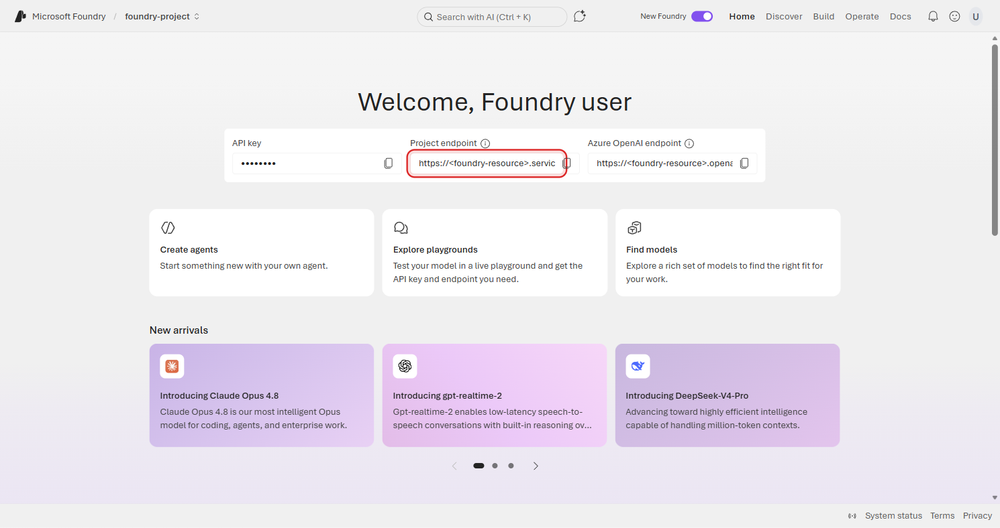

## Deploy Your First Model


> **🛠️ Pro-code alternative:** Prefer the command line? You can deploy models with the [Azure CLI](https://learn.microsoft.com/cli/azure/install-azure-cli) instead of the portal. Make sure you're logged in with `az login` first.

```bash
# Deploy gpt-5-mini via Azure CLI
az cognitiveservices account deployment create \
    --name <your-foundry-resource> \
    --resource-group <your-resource-group> \
    --deployment-name gpt-5-mini \
    --model-name gpt-5-mini \
    --model-version "1" \
    --model-format OpenAI \
    --sku-capacity 10 \
    --sku-name GlobalStandard
```

> **📍 Region availability:** Not every model is available in every region. Run this to check what's available in yours:
>
> ```bash
> az cognitiveservices model list --location <your-region> -o table
> ```


Before you can create an agent, you need a model deployed in your project. Let's get one running.

From the left sidebar, click **Discover** → **Models**. This opens the model catalog — a searchable collection of hundreds of models from OpenAI, Meta, Mistral, Microsoft, and more.

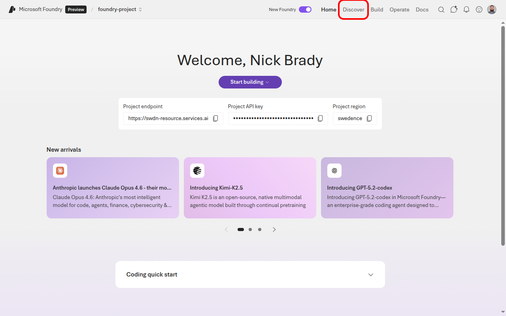

Search for **gpt-5-mini** and select it. You'll see the model card with details about capabilities, pricing, and benchmarks.

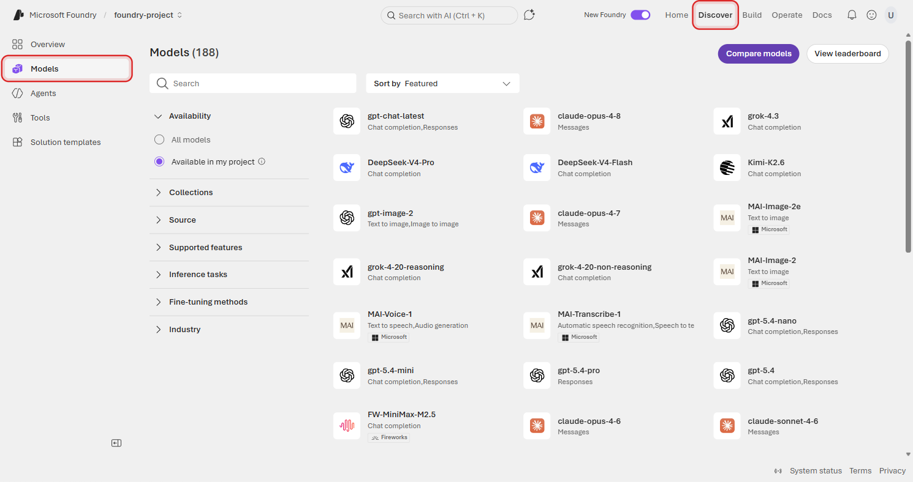

Click **Deploy** and choose **Custom Settings** so you can configure the deployment yourself.

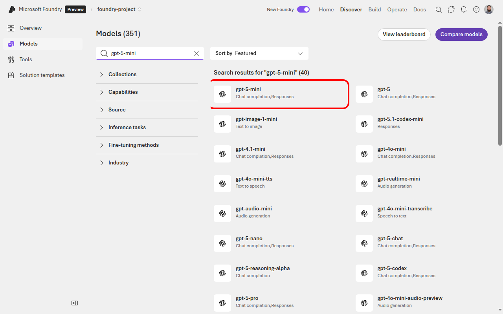

Give the deployment a name and set the quota to the maximum available. For a tutorial like this, higher quota means less throttling while you experiment.

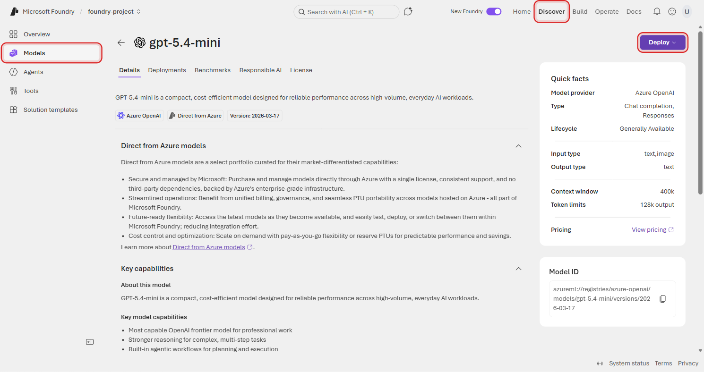

Once the deployment completes, you'll see it listed under your project's deployments.

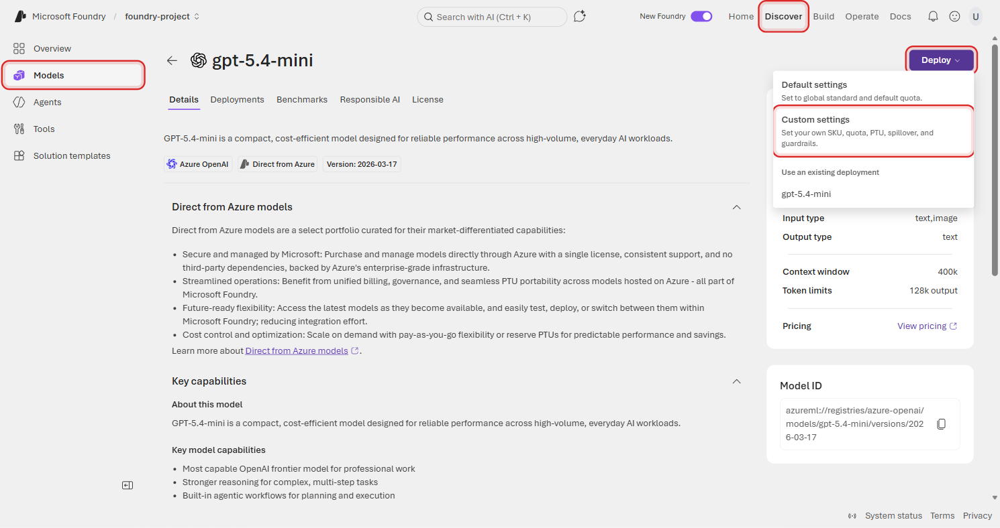

While we're here, let's deploy a few more models to see the breadth of what's available. Foundry isn't locked to a single provider — you can deploy frontier models from across the industry.

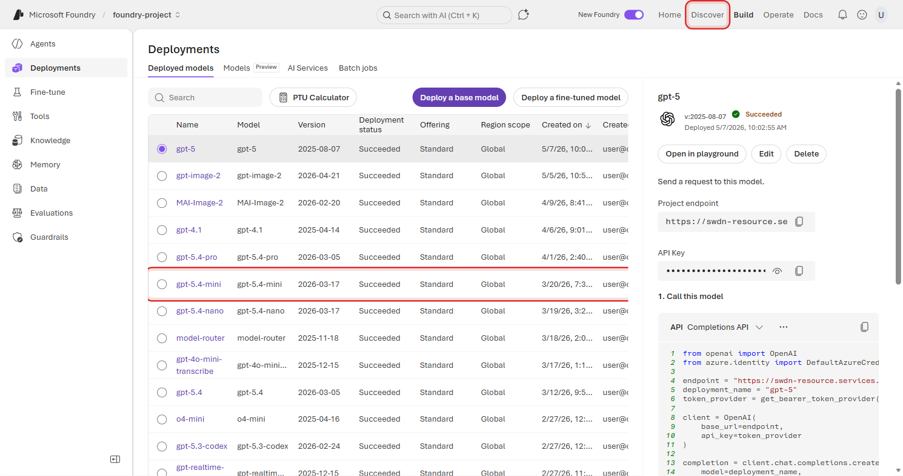

Notice the variety — DeepSeek, Mistral, Meta's Llama, Microsoft's Phi, xAI's Grok, and OpenAI's gpt-5-mini. Foundry gives you access to frontier models from every major provider, all through a single API. For this tutorial, we'll stick with `gpt-5-mini`, but it's good to know your options.


## Create Your Agent

> **🛠️ Pro-code alternative:** You can create agents entirely in Python with the [Azure AI Projects SDK](https://learn.microsoft.com/en-us/python/api/overview/azure/ai-projects-readme?view=azure-python-preview):

```bash
pip install azure-ai-projects --pre
pip install openai azure-identity python-dotenv
```

```python
from azure.identity import DefaultAzureCredential
from azure.ai.projects import AIProjectClient
from azure.ai.projects.models import PromptAgentDefinition, WebSearchPreviewTool

with (
    DefaultAzureCredential() as credential,
    AIProjectClient(
        endpoint="https://<resource>.services.ai.azure.com/api/projects/<project>",
        credential=credential,
    ) as project_client,
):
    agent = project_client.agents.create_version(
        agent_name="foundry-expert",
        definition=PromptAgentDefinition(
            model="gpt-5-mini",
            instructions="You are a helpful agent that looks up the latest information on Microsoft Foundry.",
            tools=[WebSearchPreviewTool()],
        ),
    )
```

Now for the fun part. From the left sidebar, click **Build** → **Agents**, then click **Create agent**.

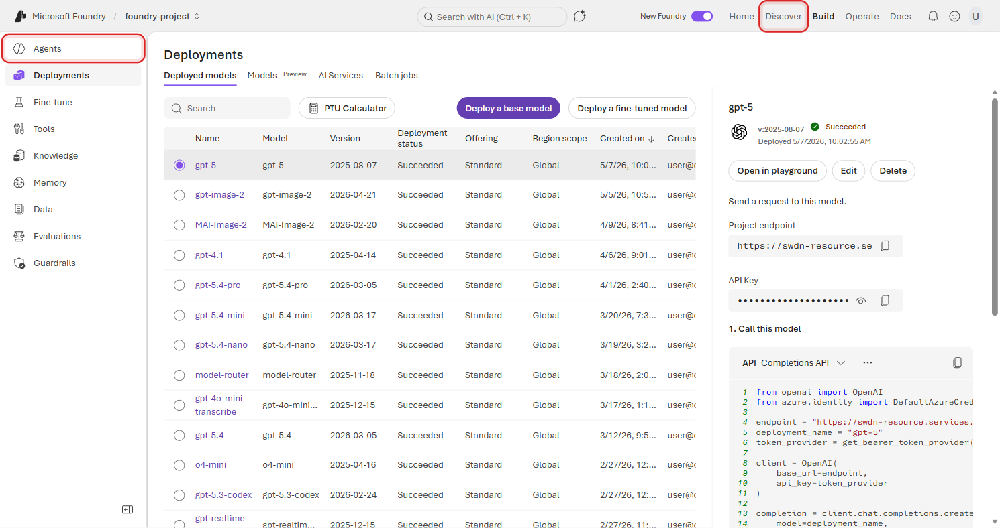

You'll land in the agent builder. The first thing to set is the **Name** — this isn't just a label, it's the identifier you'll use to reference this agent in code later. We're calling ours `foundry-expert`.

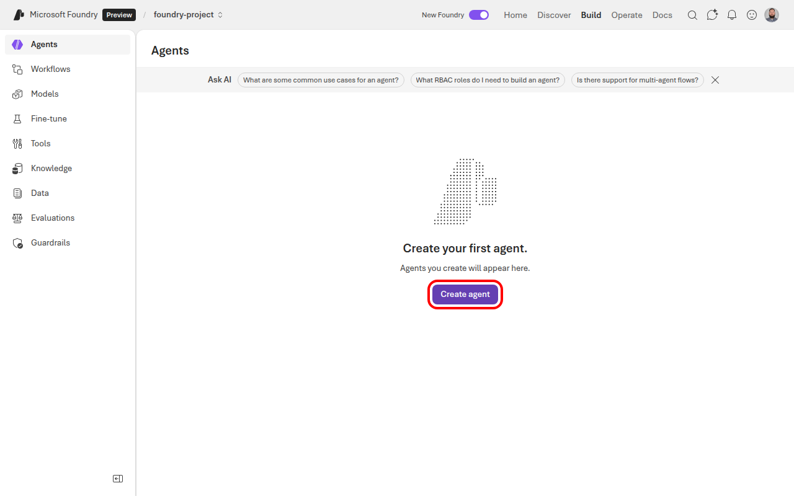

Pick a name that's descriptive and lowercase. Avoid spaces — think of it like a function name. This is the handle you'll use in the API, so make it something meaningful.

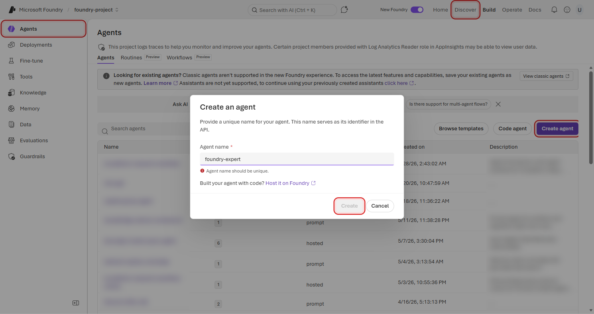


## Add Instructions

Instructions are the system prompt — they shape how your agent behaves, what it focuses on, and how it responds. Think of them as the job description you'd give a new team member.

In the **Instructions** field, paste the following:


```python
You are a helpful agent that looks up the latest information on Microsoft Foundry. You search the web for current news, documentation updates, and announcements about Microsoft Foundry and Azure AI services.
```

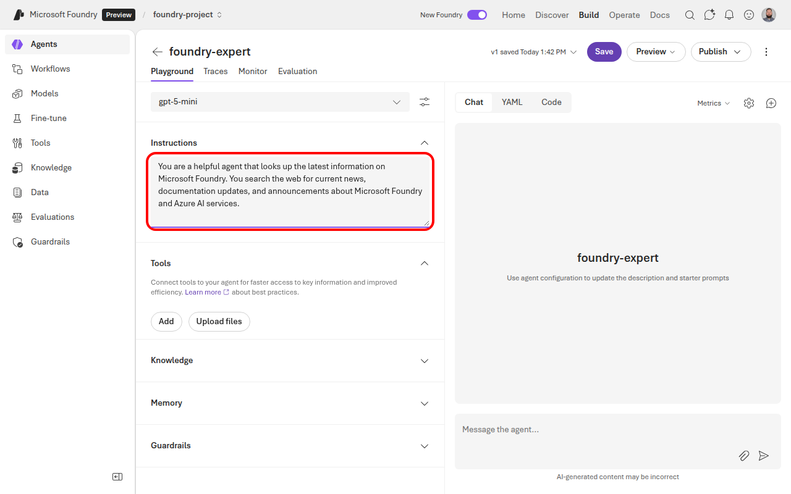

Keep instructions clear and specific. Tell the agent *what* it is, *what* it should do, and *how* it should do it. You can always refine these later — every change creates a new version, so there's no risk in iterating.


## Add the Web Search Tool

Right now your agent can think, but it can't *do* anything. Let's fix that by giving it the ability to search the web.

Scroll down to the **Tools** section and click **Add**.

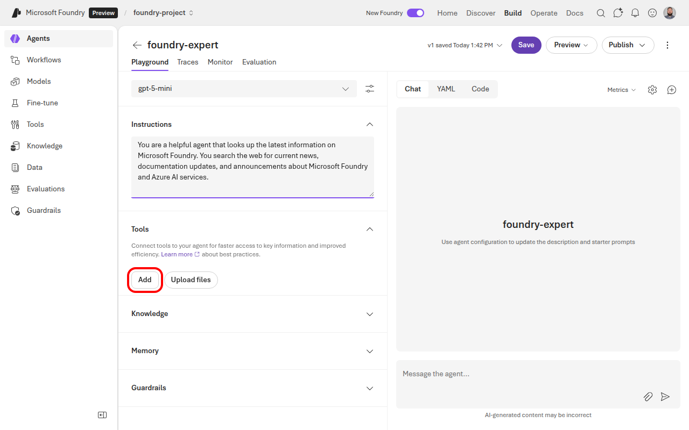

You'll see a list of preconfigured tools — these are ready-to-use capabilities you can attach to any agent. Select **Web search**.


Click **Add tool** to attach it.

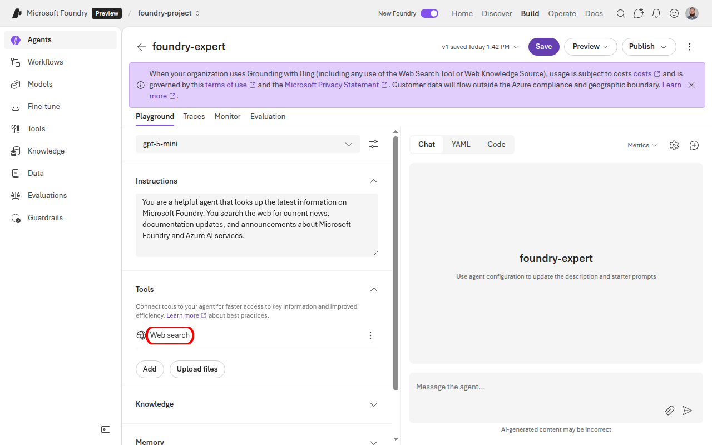

Web Search lets your agent access real-time information from the internet. Without it, the agent can only respond based on its training data. With it, your agent can pull current news, documentation, and announcements — exactly what a Foundry Expert needs.

## Save and Versioning

Click **Save** in the top bar. You'll notice something important: the portal doesn't just save — it creates a **new version**.

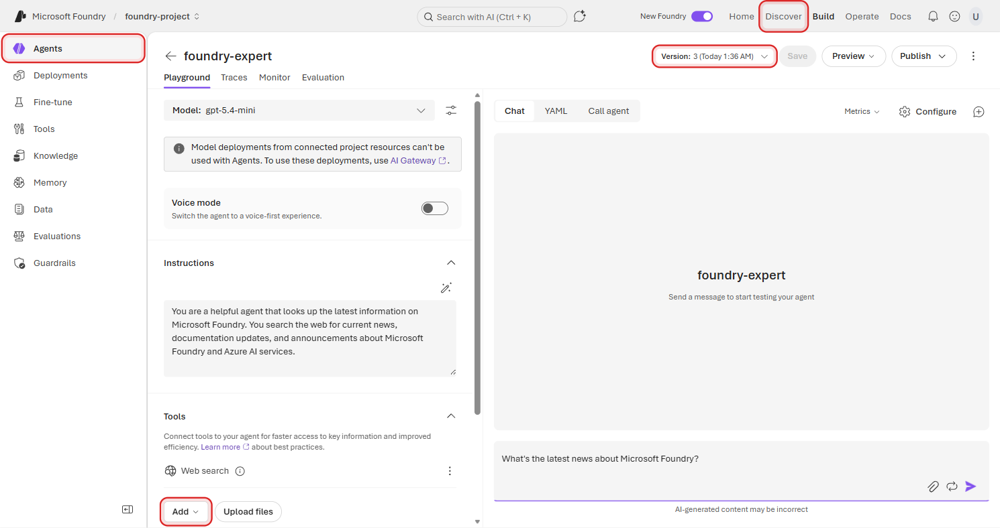

Open the version history and you'll see every save listed with a timestamp. This is crucial for iterating safely — you can always compare versions and roll back if something breaks.

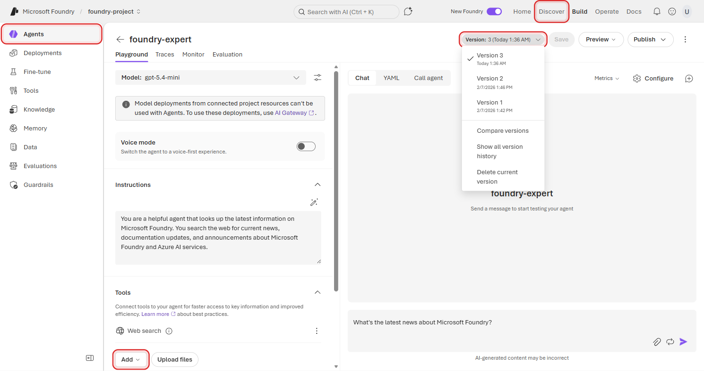

In the API, you reference agents by name + version (e.g., `foundry-expert` version `1`). This means you can test new instructions or tools on a new version while your stable version keeps running. We'll use this more in later parts of the series.

## Test Your Agent

Time to see it in action. In the chat panel on the right side, type:


```python
What's the latest news about Microsoft Foundry?
```

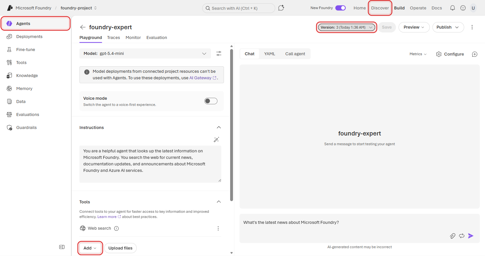

Hit send and watch what happens. Your agent searches the web, finds current information, and synthesizes a response with real-time results.

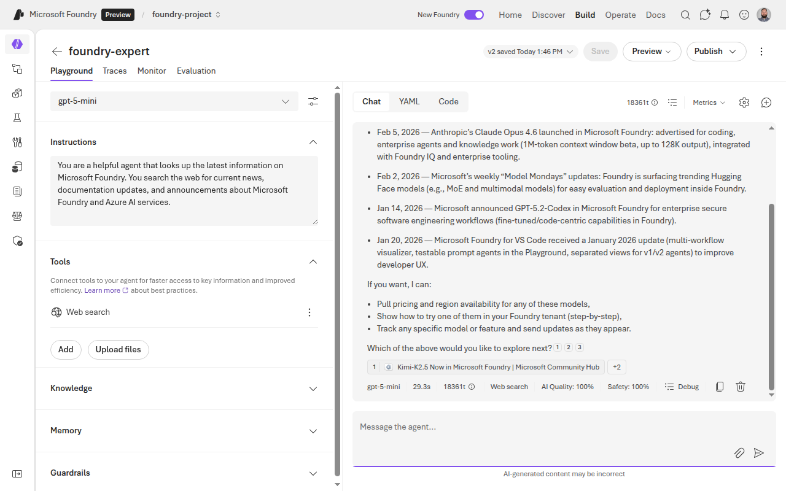

That's your agent working end to end — it received your question, decided it needed to search the web, executed the search, and composed a response from the results. All from a few lines of instructions and a single tool.


> **🛠️ Pro-code alternative:** Run a conversation with your agent using the SDK:


```python
import os
from azure.identity import DefaultAzureCredential
from azure.ai.projects import AIProjectClient

with (
    DefaultAzureCredential() as credential,
    AIProjectClient(
        endpoint="https://<resource>.services.ai.azure.com/api/projects/<project>",
        credential=credential,
    ) as project_client,
    project_client.get_openai_client() as openai_client,
):
    # Create a conversation with your question
    conversation = openai_client.conversations.create(
        items=[{"type": "message", "role": "user", "content": "What's the latest news about Microsoft Foundry?"}],
    )

    # Run the agent
    response = openai_client.responses.create(
        conversation=conversation.id,
        extra_body={"agent": {"name": "foundry-expert", "type": "agent_reference"}},
        input="",
    )

    print(response.output_text)

```

```python
# Expected output:
# Here are the latest developments regarding Microsoft Foundry:
#
# - **Microsoft Foundry Portal** — The unified portal at ai.azure.com for
#   building, deploying, and managing AI agents and models.
#
# - **Multi-provider model catalog** — Deploy frontier models from OpenAI,
#   Meta, Mistral, Microsoft, and others through a single API.
#
# - **Agent Service** — Build agents with tools like Web Search, Code
#   Interpreter, and File Search, all managed through the portal or SDK.

```

## Understanding Response Details

Look at the toolbar below the agent's response. This is where you go from "it works" to "I understand *how* it works."

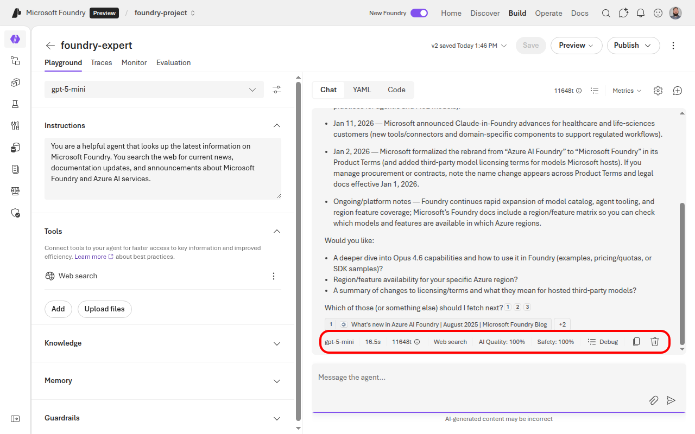

Each element gives you a different lens into what just happened:

| Element | What It Tells You |
|---------|-------------------|
| **Model** | Which model processed this response (e.g., `gpt-5-mini`) |
| **Tokens** | How many tokens were consumed — both the response tokens and the conversation total |
| **Tools** | Which tools the agent invoked (e.g., `Web search`) |
| **AI Quality** | Automated evaluation of response quality (0-100%) |
| **Safety** | Automated safety evaluation — checks for harmful content (0-100%) |
| **Debug** | Opens the full execution trace — see exactly what happened under the hood |

These metrics update with every response. The quality and safety scores are powered by [Foundry's built-in evaluators](https://learn.microsoft.com/azure/ai-foundry/evaluation) — the same ones you can run at scale in Part 3.

## Debug Tracing

Click **Debug** to open the full execution trace. This is where you see *exactly* what happened behind the scenes.

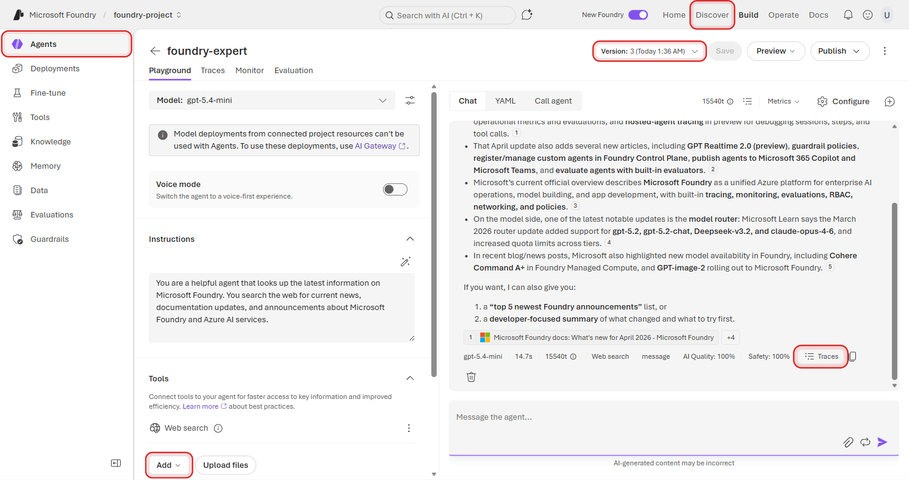

The trace shows the complete execution flow: **Conversation → Response → tool calls**. You can see that the agent decided to call `web_search` and then used the results to compose its answer.

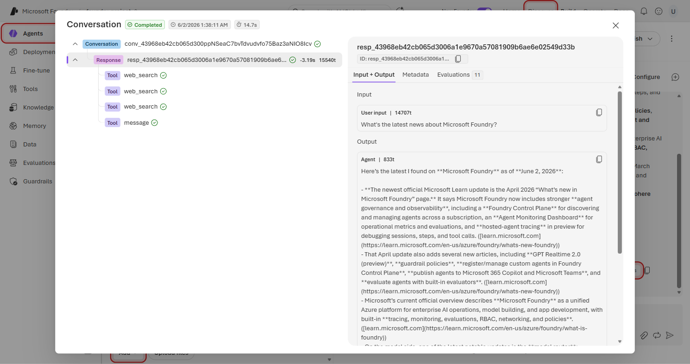

Click into the `web_search` node and you'll see something interesting — the exact search query the model generated on its own.

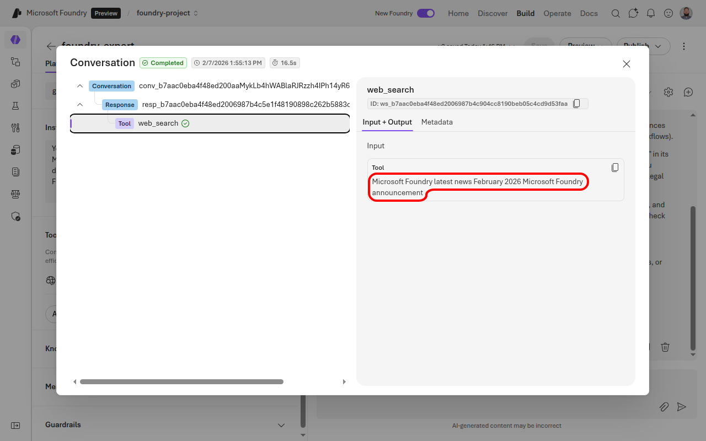

Look at that: from your simple prompt "What's the latest news about Microsoft Foundry?", the model autonomously crafted the search query *"Microsoft Foundry latest news February 2026 Microsoft Foundry announcement"*. It added the current date and refined the query for better results — no prompt engineering required.

This is observability built in — no extra setup, no external tracing tools, no SDK configuration. You get full visibility into every decision your agent makes, right from the portal. In Part 3, we'll export these traces and build automated evaluations on top of them.


## Preview, Share, and Code

Your agent is working — but right now only you can see it. Before deploying to production, you can share a preview with your team.

Click **Preview** in the top bar to open the dropdown, then select **Preview agent**.

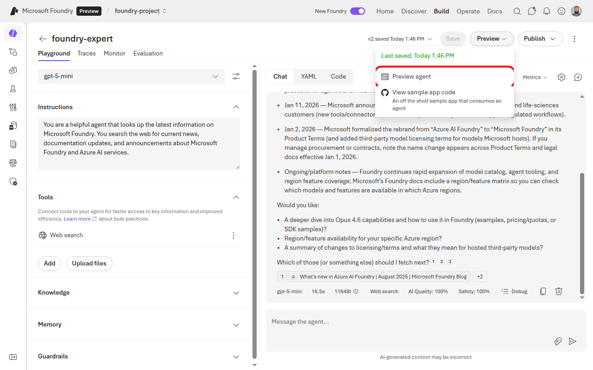

This opens a clean, standalone chat interface — no portal chrome, no configuration panels. Just your agent, ready for someone to try.

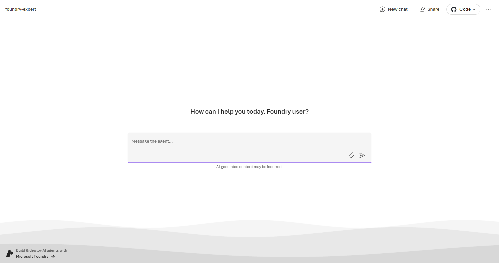

The preview page toolbar gives you four actions:

| Button | What it does |
| --- | --- |
| **New chat** | Start a fresh conversation |
| **Share** | Copy a shareable link so teammates can test the agent |
| **Code** (GitHub icon) | View sample app code on GitHub — an off-the-shelf app you can fork and customize |
| **⋯** (ellipsis) | Settings (theme, language), terms of use, privacy, and feedback |

### Sharing Your Agent

Click **Share** to get a link you can send to anyone on your team.

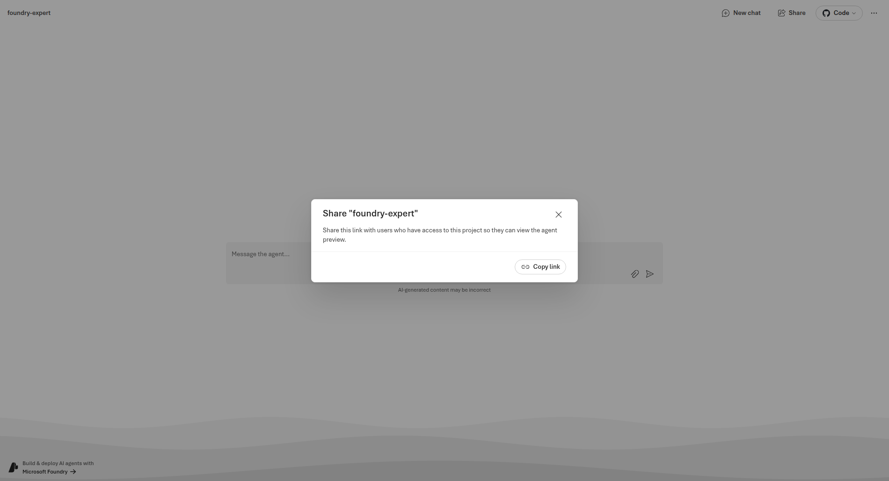

> **Important:** To use a shared agent link, users must have at minimum the **Azure AI User** role on your project. Without this role, the link will return an access denied error. You can assign roles in the Azure portal under **Access control (IAM)** for your AI resource or resource group.

### Getting the Code

Click the **Code** button (with the GitHub icon) to see a ready-to-use sample application.

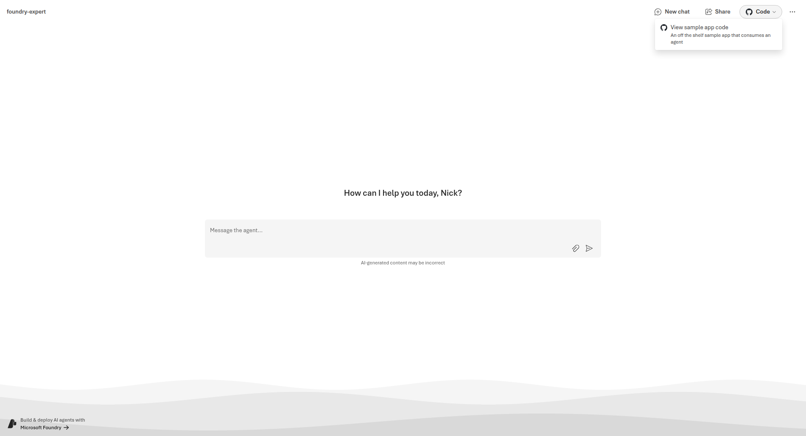

Select **View sample app code** to open the GitHub repository. This is an off-the-shelf application that consumes your agent — fork it, customize it, and deploy it as your own.

Back on the Playground, you'll also find a **Code** tab that generates a Python, C#, or JavaScript snippet with your project endpoint and agent name pre-filled. We'll explore that path in **Part 2**.


## What's Next

You just built and tested your first agent — entirely from the portal. It has a name, instructions, a model, and a tool. It can search the web and answer questions about Microsoft Foundry with real-time information.

In **Part 2** (coming soon), you'll:
- Explore the full tool catalog (1,400+ tools and counting)
- Add Microsoft Learn and GitHub MCP servers to your agent
- Switch from the portal to code using the YAML and Code tabs
- Launch VS Code for the web and make your first code change