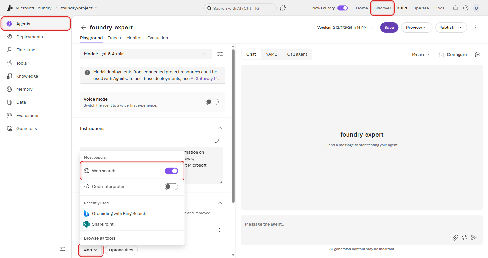
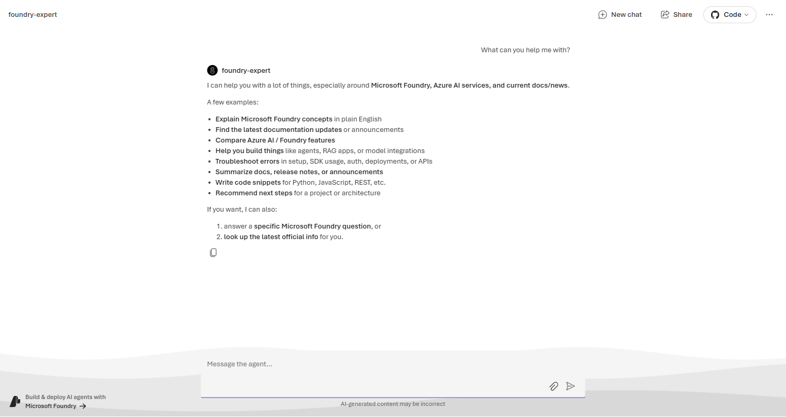
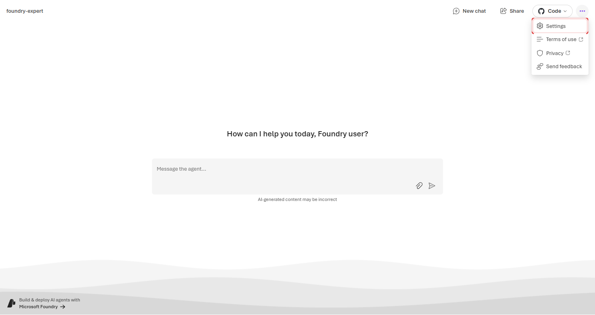
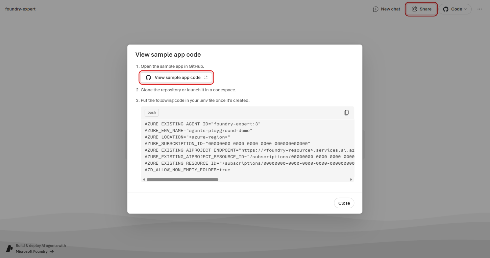
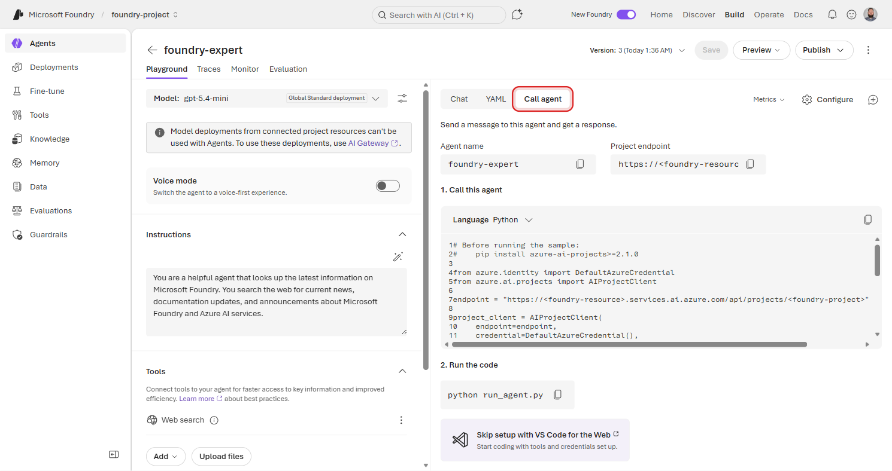

*Prototype a Foundry agent in the portal, then use it as the first step toward production*

This is **Part 1** of a 4-part series where you build **foundry-expert** — an AI agent that answers Microsoft Foundry questions using the web, official docs, source code, and later enterprise knowledge. The series follows the production agent lifecycle Microsoft Foundry is built for: prototype in the portal, ground with authoritative tools and knowledge, move into code, evaluate, and prepare for hosted production and Microsoft 365 Copilot.

| Part | Focus |
|------|-------|
| **1. Create Your First Agent** | Prototype an agent in the portal and inspect its first trace |
| 2. Tools and Your First Code | Ground the agent with authoritative MCP tools, then inspect YAML and Python |
| 3. Tools, Tracing, and Evaluations | Pro-code: custom tools or Toolboxes, observability, evals, and guardrails |
| 4. Deploy, Govern, and Optimize | Hosted runtime, memory, Microsoft 365 Copilot, and continuous optimization |

**What you'll do in Part 1:**
- Navigate the Foundry portal and find your project endpoint
- Deploy `gpt-5.4-mini` alongside frontier models from multiple providers
- Create an agent with a name, instructions, and the Web Search tool
- Test your agent with a real question
- Understand versioning, response details, and trace inspection

## What is Foundry Agent Service?

Foundry Agent Service is the platform inside Microsoft Foundry for building, testing, deploying, and operating AI agents. An agent is more than a chat model — it's a model that can *act*. It can search the web, look up documents, run code, and call APIs, all based on natural language instructions you give it.

Think of it this way: a model *thinks*, but an agent *does*.

Every agent you build is assembled from six building blocks:

| Building Block | What It Means |
|---------------|---------------|
| **Name** | What it's called — its identity in the API |
| **Instructions** | How it should behave — its system prompt |
| **Model** | The reasoning engine it thinks with |
| **Knowledge** | What it should know — docs, files, search indexes, and enterprise knowledge bases |
| **Tools** | What it can do — search, execute code, call APIs |
| **Memory** | What it remembers across conversations |

In this tutorial, you'll set the first five: a name, instructions, a model, knowledge from Web Search, and a tool. Memory becomes more important as the agent matures — later in the series, you'll see how user, session, and procedural memory fit into production agents.

## Navigate to Your Project

Head to [ai.azure.com/nextgen](https://ai.azure.com/nextgen) and select your project. The first thing you'll want to note is your **Project endpoint** — you'll need this later when you move to code.


## Deploy Your First Model


> **🛠️ Pro-code alternative:** Prefer the command line? You can deploy models with the [Azure CLI](https://learn.microsoft.com/cli/azure/install-azure-cli) instead of the portal. Make sure you're logged in with `az login` first.

```bash
# Deploy gpt-5.4-mini via Azure CLI
az cognitiveservices account deployment create \
    --name <your-foundry-resource> \
    --resource-group <your-resource-group> \
    --deployment-name gpt-5.4-mini \
    --model-name gpt-5.4-mini \
    --model-version "1" \
    --model-format OpenAI \
    --sku-capacity 10 \
    --sku-name GlobalStandard
```

> **📍 Region availability:** Not every model is available in every region. Run this to check what's available in yours:
>
> ```bash
> az cognitiveservices model list --location <your-region> -o table
> ```


Before you can create an agent, you need a model deployed in your project. Let's get one running.

From the top navigation, click **Discover**, then open **Models** from the left navigation. This opens the model catalog — a searchable collection of hundreds of models from OpenAI, Meta, Mistral, Microsoft, and more.


Search for **gpt-5.4-mini**. The filtered results show `gpt-5.4-mini` as the top match.


Select **gpt-5.4-mini** to open the model details page. You'll see the model card with details about capabilities, pricing, lifecycle status, and supported tasks.


Click **Deploy** and choose **Custom settings** so you can configure the deployment yourself.


Give the deployment a name and set the quota to the maximum available. For a tutorial like this, higher quota means less throttling while you experiment.

Once the deployment completes, you'll see it listed under your project's **Build → Deployments** page alongside any other model deployments in the project.


Notice the variety — DeepSeek, Mistral, Meta's Llama, Microsoft's Phi, xAI's Grok, and OpenAI's gpt-5.4-mini. Foundry gives you access to frontier models from every major provider, all through a single API. For this tutorial, we'll stick with `gpt-5.4-mini`, but it's good to know your options.


## Create Your Agent

> **🛠️ Pro-code alternative:** You can create agents entirely in Python with the [Azure AI Projects SDK](https://learn.microsoft.com/en-us/python/api/overview/azure/ai-projects-readme?view=azure-python-preview):

```bash
pip install azure-ai-projects --pre python-dotenv
```

```python
from azure.identity import DefaultAzureCredential
from azure.ai.projects import AIProjectClient
from azure.ai.projects.models import PromptAgentDefinition, WebSearchTool

with (
    DefaultAzureCredential() as credential,
    AIProjectClient(
        endpoint="https://<resource>.services.ai.azure.com/api/projects/<project>",
        credential=credential,
    ) as project_client,
):
    agent = project_client.agents.create_version(
        agent_name="foundry-expert",
        definition=PromptAgentDefinition(
            model="gpt-5.4-mini",
            instructions="You are a helpful agent that looks up the latest information on Microsoft Foundry.",
            tools=[WebSearchTool()],
        ),
    )
```

Now for the fun part. From the left sidebar, click **Build** → **Agents**, then click **Create agent**.


You'll land on the Agents page. Click **Create agent** to start a new agent definition.


Pick a name that can work as an API identifier. The SDK describes `agent_name` as the unique name used to retrieve, update, and delete the agent. It must start and end with alphanumeric characters, can contain hyphens in the middle, and must be 63 characters or fewer. We're calling ours `foundry-expert`.


## Add Instructions

Instructions are the system prompt — they shape how your agent behaves, what it focuses on, and how it responds. Think of them as the job description you'd give a new team member.

In the **Instructions** field, paste the following:


```text
You are a helpful agent that looks up the latest information on Microsoft Foundry. You search the web for current news, documentation updates, and announcements about Microsoft Foundry and Azure AI services.
```


Keep instructions clear and specific. Tell the agent *what* it is, *what* it should do, and *how* it should do it. You can always refine these later — every change creates a new version, so there's no risk in iterating.


## Add the Web Search Tool

Right now your agent can think, but it can't *do* anything. Let's fix that by giving it the ability to search the web.

Scroll down to the **Tools** section and click **Add**.


The **Add** menu shows popular tools you can toggle on for the agent. Select **Web search** if it is not already enabled.



When the toggle is on, Web Search is attached to the agent.


Web Search lets your agent access real-time information from the internet. Without it, the agent can only respond based on its training data. With it, your agent can pull current news, documentation, and announcements — exactly what a Foundry Expert needs.

## Save and Versioning

Click **Save** in the top bar. You'll notice something important: the portal doesn't just save — it creates a **new version**.


Open the version history and you'll see every save listed with a timestamp. This is crucial for iterating safely — you can always compare versions and roll back if something breaks.


In the API, you reference agents by name + version (e.g., `foundry-expert` version `3`). This means you can test new instructions or tools on a new version while your stable version keeps running. We'll use this more in later parts of the series.

## Test Your Agent

Time to see it in action. In the chat panel on the right side, type:


```text
What's the latest news about Microsoft Foundry?
```


Hit send and watch what happens. Your agent searches the web, finds current information, and synthesizes a response with real-time results.


That's your agent working end to end — it received your question, decided it needed to search the web, executed the search, and composed a response from the results. All from a few lines of instructions and a single tool.


> **🛠️ Pro-code alternative:** Run a conversation with your agent using the SDK:


```python
import os
from azure.identity import DefaultAzureCredential
from azure.ai.projects import AIProjectClient

with (
    DefaultAzureCredential() as credential,
    AIProjectClient(
        endpoint="https://<resource>.services.ai.azure.com/api/projects/<project>",
        credential=credential,
    ) as project_client,
    project_client.get_openai_client() as openai_client,
):
    # Create a conversation with your question
    conversation = openai_client.conversations.create(
        items=[{"type": "message", "role": "user", "content": "What's the latest news about Microsoft Foundry?"}],
    )

    # Run the agent
    response = openai_client.responses.create(
        conversation=conversation.id,
        extra_body={"agent": {"name": "foundry-expert", "type": "agent_reference"}},
        input="",
    )

    print(response.output_text)

```

Expected output:

```text
Here are the latest developments regarding Microsoft Foundry:

- Microsoft Foundry Portal — The unified portal at ai.azure.com for building, deploying, and managing AI agents and models.
- Multi-provider model catalog — Deploy frontier models from OpenAI, Meta, Mistral, Microsoft, and others through a single API.
- Agent Service — Build agents with tools like Web Search, Code Interpreter, and File Search, all managed through the portal or SDK.
```


## Understanding Response Details

Look at the toolbar below the agent's response. This is where you go from "it works" to "I understand *how* it works."


Each element gives you a different lens into what just happened:

| Element | What It Tells You |
|---------|-------------------|
| **Model** | Which model processed this response (e.g., `gpt-5.4-mini`) |
| **Tokens** | How many tokens were consumed — both the response tokens and the conversation total |
| **Tools** | Which tools the agent invoked (e.g., `Web search`) |
| **AI Quality** | Automated evaluation of response quality (0-100%) |
| **Safety** | Automated safety evaluation — checks for harmful content (0-100%) |
| **Traces** | Opens the full execution trace — see exactly what happened under the hood |

These metrics update with every response. The quality and safety scores are powered by [Foundry's built-in evaluators](https://learn.microsoft.com/azure/ai-foundry/evaluation) — the same ones you can run at scale in Part 3.

## Trace Inspection

Click **Traces** to open the full execution trace. This is where you see *exactly* what happened behind the scenes.


The trace shows the complete execution flow: **Conversation → Response → tool calls**. You can see that the agent decided to call `web_search` and then used the results to compose its answer.


Click into a `web_search` node and you'll see something interesting — the exact search query the model generated on its own.


Look at that: from your simple prompt "What's the latest news about Microsoft Foundry?", the model autonomously crafted a targeted search query. The screenshot captures one run, so the exact query may differ — for example, a current run might focus on Microsoft Learn, Build announcements, or another recent source. The important pattern is that the agent refines your natural-language prompt into a tool-specific query without you hardcoding it.

This is observability built in — no extra setup, no external tracing tools, no SDK configuration. You get full visibility into every decision your agent makes, right from the portal. In Part 3, these traces become raw material for evaluation datasets, debugging, and optimization.

## Preview, Share, and Code

Your agent is working — but right now only you can see it in the builder. Before deploying to production, use the standalone preview app to test the experience your teammates will see.

Click **Preview** in the top bar to open the dropdown, then select **Preview agent**.


This opens a clean, standalone chat interface — no builder panels, no configuration controls. Just your agent, ready for someone to try.


Try a quick prompt in the preview app so you know the shared experience works outside the builder:

> *"What can you help me with?"*



The preview page toolbar gives you four actions:

| Button | What it does |
| --- | --- |
| **New chat** | Start a fresh conversation |
| **Share** | Copy a shareable link so teammates can test the agent |
| **Code** (GitHub icon) | View sample app code — an off-the-shelf app you can fork and customize |
| **Settings** | Theme, language, terms of use, privacy, and feedback |



### Sharing Your Agent

Click **Share** to get a link you can send to anyone on your team.


> **Important:** To use a shared agent link, users must have at minimum the **Foundry User** role on your project. Without this role, the link will return an access denied error. You can assign roles in the Azure portal under **Access control (IAM)** for your AI resource or resource group.

### Getting the Code

Click the **Code** button with the GitHub icon to see the sample app handoff.


Select **View sample app code**. The dialog gives you a GitHub entry point and placeholder environment variables for wiring an app to this agent.



Back on the Playground, you'll also find a **Call agent** tab that generates a Python snippet with your project endpoint and agent name pre-filled.



We'll explore the code-owned path in **Part 2**.

## What's Next

You just built and tested your first agent — entirely from the portal. It has a name, instructions, a model, knowledge from Web Search, and a tool. It can answer Microsoft Foundry questions with current public context, and you can inspect the trace behind each answer.

In **Part 2**, you'll:
- Add Microsoft Learn and GitHub MCP servers to ground answers in official docs and source code
- Handle MCP approval requests — the first governance loop you'll meet
- Switch from the portal to source-controlled YAML and Python
- See how direct MCP connections relate to Toolboxes and Foundry IQ as the production path