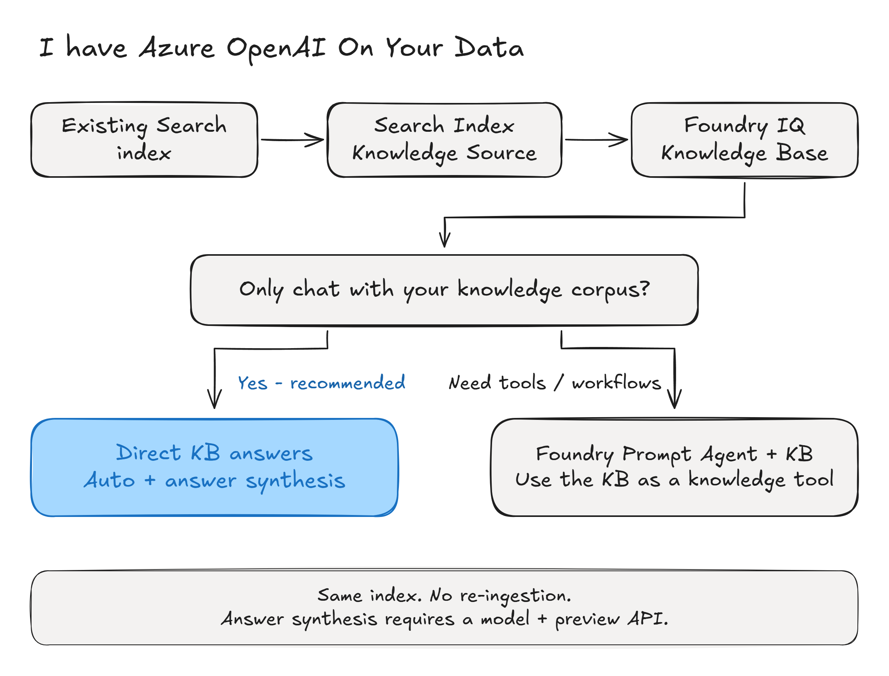

> **[Azure OpenAI On Your Data retires October 14, 2026.](https://learn.microsoft.com/azure/foundry-classic/openai/concepts/use-your-data)**

Already using Azure OpenAI On Your Data (OYD) to chat with an Azure AI Search index?
**Keep the index. Wrap it in a Search Index Knowledge Source, attach that source to a
Foundry IQ Knowledge Base, and call the KB directly for a cited answer.**

For this corpus-chat use case, start with **`auto` retrieval + `answerSynthesis`**.
Auto starts with lightweight retrieval and can escalate to LLM-based query planning,
up to medium effort, if the first pass lacks grounding. Answer synthesis uses your
configured model to write the answer. Neither setting means model-free or fixed-cost.

```text
Before: app -> Azure OpenAI chat.completions + data_sources -> answer + citations
After:  app -> Foundry IQ KB.retrieve -> answer + references + activity
                          |
                 Search Index Knowledge Source
                          |
                 Your existing Search index
```

**By the end, you will be able to:**
- Reuse an existing Search corpus through a knowledge source and knowledge base.
- Replace an OYD call with direct KB answer synthesis and native citations.
- Evaluate citation resolution and abstention before cutting over your application.

This recipe does not re-index data, edit your index, deploy a model, add other source
types, or create an agent.

> **Preview boundary.** This path uses `2026-08-01-preview`. GA `2026-04-01` supports
> minimal, extractive retrieval, not answer synthesis. Confirm that preview features
> meet your deployment requirements before choosing this path.

## Choose the migration path

Both paths reuse your index through a **Search Index Knowledge Source + Foundry IQ KB**.



[Download editable Excalidraw source](media/migrate-oyd-to-foundry-iq/01-oyd-migration-decision-tree.excalidraw)

An agent is not required just to answer corpus questions, carry conversation history,
or add another knowledge source. The OYD retirement notice recommends Agent Service
with Foundry IQ generally; this recipe recommends the narrower direct-KB path when
retrieval and answer generation are all your application needs.

## Prerequisites

| Requirement | What to check |
|---|---|
| Python | 3.10 or later, with a Jupyter kernel. |
| Azure AI Search | Your existing service, in a [region supporting agentic retrieval](https://learn.microsoft.com/azure/search/search-region-support). The index and KB must be on the same service. |
| Existing index | Match the [index requirements](https://learn.microsoft.com/azure/search/agentic-retrieval-how-to-create-index). Carry over your semantic configuration when present; it is optional in this preview. Vector retrieval needs a valid query-time vectorizer, not just stored vectors. |
| Chat model | An existing [supported Azure OpenAI deployment](https://learn.microsoft.com/azure/search/agentic-retrieval-how-to-create-knowledge-base#supported-models). Reuse your OYD deployment only while that model/version remains available; GPT-4-family models are deprecated. Otherwise select an already-deployed supported model, such as `gpt-5.4-mini`. |
| Access | Permission to manage the new KS/KB and query the index. This example uses a Search admin key and a model API key; see the Entra ID guidance below for production. |

**Cost:** Search retrieval/reranking and model tokens are billable. Auto can add planning
work; synthesis always needs a configured model. Measure quality, latency, and usage on
your own queries rather than assuming lower cost or better answers than OYD.

**Access-control boundary:** keep any OYD filters and field mappings. The default example
assumes all users of the application are authorized for the selected corpus. For an index
using per-user permission metadata, set `USES_PER_USER_ACL = True` below and supply the
verified signed-in user's Search token on every retrieve call. The helper rejects a missing
token in that mode. Never replace per-user checks with a system prompt or an admin key.

Set these in your shell or an uncommitted local `.env` next to the notebook. Use your
actual deployment name and model family; they are not necessarily the same string.

```bash
SEARCH_ENDPOINT=https://<your-search-service>.search.windows.net
SEARCH_API_KEY=<your-search-admin-key>
SEARCH_INDEX_NAME=<your-existing-index>
SEARCH_SEMANTIC_CONFIG=<your-semantic-config-name>   # optional in this preview
# Optional: carry over your OYD filter and field mappings; use actual index field names.
# SEARCH_FILTER is a static default; pass caller-specific filters to kb_answer per request.
# SEARCH_FILTER=status eq 'published'
# SEARCH_CONTENT_FIELDS=content
# SEARCH_SOURCE_FIELDS=title,url,content

AOAI_ENDPOINT=https://<your-foundry-resource>.openai.azure.com
AOAI_API_KEY=<your-azure-openai-key>
AOAI_GPT_DEPLOYMENT=<your-supported-chat-deployment>
AOAI_GPT_MODEL=gpt-5.4-mini                          # underlying model, not deployment name
```

If OYD generated query vectors through `embedding_dependency` but the index has no
vectorizer, the KB does not automatically reproduce that setup. Configure and validate
query-time vectorization separately before cutover, or explicitly evaluate text-only
retrieval. This notebook never changes your index.

### Install

Install the pinned [public PyPI preview](https://pypi.org/project/azure-search-documents/12.1.0b2/).
It supports `2026-08-01-preview`; no extra package feed or legacy OpenAI client is needed.

Preview APIs can change. Review the [SDK changelog](https://github.com/Azure/azure-sdk-for-python/blob/main/sdk/search/azure-search-documents/CHANGELOG.md)
and [API migration guide](https://learn.microsoft.com/azure/search/agentic-retrieval-how-to-migrate)
before changing this pin.

```python
%pip install --quiet \
    "azure-search-documents==12.1.0b2" \
    "azure-core>=1.32.0" \
    "python-dotenv>=1.0.1"
```

## Configure

Choose one question your corpus can answer and one it cannot. Each run uses unique KS/KB
names and create-only operations, so it cannot overwrite existing objects. Keep the printed
names if you stop before cleanup; rerunning this setup starts a new pair.

```python
import json
import os
import re
from time import perf_counter
from uuid import uuid4

from azure.core.credentials import AzureKeyCredential
from azure.search.documents.indexes import SearchIndexClient
from dotenv import load_dotenv

load_dotenv()


def env(name, *, required=True, default=None):
    value = os.getenv(name, default)
    if required and not value:
        raise RuntimeError(f"Missing required env var: {name}")
    return value


def field_names(name):
    return [value.strip() for value in os.getenv(name, "").split(",") if value.strip()]


SEARCH_ENDPOINT = env("SEARCH_ENDPOINT").rstrip("/")
SEARCH_API_KEY = env("SEARCH_API_KEY")
SEARCH_INDEX = env("SEARCH_INDEX_NAME")
SEMANTIC_CONFIG = env("SEARCH_SEMANTIC_CONFIG", required=False)
SEARCH_FILTER = env("SEARCH_FILTER", required=False)
CONTENT_FIELDS = field_names("SEARCH_CONTENT_FIELDS")
SOURCE_FIELDS = field_names("SEARCH_SOURCE_FIELDS")

AOAI_ENDPOINT = env("AOAI_ENDPOINT").rstrip("/")
AOAI_API_KEY = env("AOAI_API_KEY")
AOAI_DEPLOYMENT = env("AOAI_GPT_DEPLOYMENT")
AOAI_MODEL = env("AOAI_GPT_MODEL")
SEARCH_API_VERSION = "2026-08-01-preview"

run_id = uuid4().hex[:12]
KS_NAME = f"oyd-migrated-ks-{run_id}"
KB_NAME = f"oyd-migrated-kb-{run_id}"
created_ks = created_kb = False

# Replace this with your existing OYD instructions.
SYSTEM_MESSAGE = (
    "You are a helpful assistant for our company. Answer the question using only the "
    "information in the retrieved sources."
)

ABSTENTION = "I don't know"
QUESTION = "What is our return policy?"
UNSUPPORTED_QUESTION = "What is the current temperature inside my kitchen?"
USES_PER_USER_ACL = False  # Set True for an index with per-user permission metadata.
USER_SEARCH_TOKEN = None  # Obtain for the signed-in user in memory; never save it in .env.

search_credential = AzureKeyCredential(SEARCH_API_KEY)
index_client = SearchIndexClient(
    endpoint=SEARCH_ENDPOINT, credential=search_credential, api_version=SEARCH_API_VERSION
)

print(f"Search : {SEARCH_ENDPOINT}  (index: {SEARCH_INDEX})")
print(f"Model  : {AOAI_DEPLOYMENT} ({AOAI_MODEL})")
print(f"New resources: {KS_NAME}, {KB_NAME}")
```

## 1 · Identify the OYD call in your application

The old call uses `chat.completions.create` with an `azure_search` entry in `data_sources`.
The reference below identifies that request shape; it is not executed by this notebook.
Retired or unavailable OYD deployments must not block the new path. All names in the
snippet belong to the existing application, not the setup above.

Inspect `existing_search_parameters` for your original query type, vector/embedding
settings, field mappings, filters, and authentication. Preserve them during migration.
If OYD is still available, capture a baseline through your existing permission-enforcing
application; do not recreate a less restrictive call just for comparison.

```python
# Reference only: locate this call in the application you are migrating.
oyd_response = oyd_client.chat.completions.create(
    model=oyd_deployment,
    messages=messages,
    extra_body={
        "data_sources": [
            {"type": "azure_search", "parameters": existing_search_parameters}
        ]
    },
)
```

## 2 · How the parameters map

Keep the index connection separate from answer behavior and per-request controls.
These are migration starting points, not a claim that OYD and KB ranking are equivalent.

| OYD setting | Foundry IQ setting | Lives on |
|---|---|---|
| `endpoint` | `SearchIndexClient` / `KnowledgeBaseRetrievalClient` endpoint | client |
| `index_name` | `SearchIndexKnowledgeSourceParameters(search_index_name=...)` | Knowledge Source |
| `semantic_configuration` | `SearchIndexKnowledgeSourceParameters(semantic_configuration_name=...)` | Knowledge Source |
| `authentication` | `AzureKeyCredential` (or `DefaultAzureCredential`) | client |
| System / grounding instructions | `answer_instructions`; test abstention separately | Knowledge Base |
| Model deployment | `deployment_name` plus the actual `model_name` | Knowledge Base model |
| `filter` | `kb_answer(filter_add_on=...)`; pass a trusted, caller-specific filter when required | retrieve source params |
| `fields_mapping.content_fields` | `search_fields`; select retrievable citation/content fields with `source_data_fields` | Knowledge Source |
| `strictness` | No exact conversion. Evaluate `reranker_threshold` independently if needed. | retrieve source params |
| `top_n_documents` | Top-level `max_output_documents` caps final grounding documents, but is not identical to OYD context selection. | retrieve request |
| `query_type` / `embedding_dependency` | Review semantic configuration, existing vector fields, and a valid query-time vectorizer. Do not assume hybrid behavior. | index / Knowledge Source |

Per-source `max_output_documents` caps intermediate candidates; the top-level setting
caps final grounding documents. The example uses a final cap of five, not the old
50-200 candidate-pool rule. Retune with your corpus rather than translating OYD knobs
numerically. Index scoring profiles are not honored by KB retrieve.

Auto controls retrieval effort, while `answerSynthesis` controls the output. They are
independent settings: an adaptive retrieval pipeline can still return a finished answer.

## 3 · Create the Knowledge Source over your existing index

A Knowledge Source of kind `searchIndex` is a thin wrapper that points at an index you
already have. **Nothing is re-indexed, copied, or moved** — it references your index in
place. This maps the OYD `index_name` and `semantic_configuration`.

```python
from azure.search.documents.indexes.models import (
    SearchIndexFieldReference,
    SearchIndexKnowledgeSource,
    SearchIndexKnowledgeSourceParameters,
)

ks_parameters = SearchIndexKnowledgeSourceParameters(
    search_index_name=SEARCH_INDEX,
    search_fields=[SearchIndexFieldReference(name=name) for name in CONTENT_FIELDS],
    source_data_fields=[SearchIndexFieldReference(name=name) for name in SOURCE_FIELDS],
)
if SEMANTIC_CONFIG:
    ks_parameters.semantic_configuration_name = SEMANTIC_CONFIG

knowledge_source = SearchIndexKnowledgeSource(
    name=KS_NAME,
    description="Wraps the existing On Your Data search index.",
    search_index_parameters=ks_parameters,
)
index_client.create_knowledge_source(knowledge_source)
created_ks = True
print(f"Knowledge Source '{KS_NAME}' now points at index '{SEARCH_INDEX}'.")
```

## 4 · Create the KB with auto retrieval and answer synthesis

Attach your supported chat deployment, set `auto`, and enable `answerSynthesis`.
The [current KB creation guide](https://learn.microsoft.com/azure/search/agentic-retrieval-how-to-create-knowledge-base#create-a-knowledge-base)
documents this combination for `2026-08-01-preview`.

Auto starts with lightweight retrieval and can escalate up to medium effort when
grounding is insufficient. The model is still required for synthesis. Your app receives
a natural-language answer, but must adapt to KB references rather than OYD's citation
shape; this is not a wire-compatible drop-in replacement.

The abstention instruction below defines an exact output contract for this recipe.
It is not an authorization control or a guarantee of factual correctness.

```python
from azure.search.documents.indexes.models import (
    AzureOpenAIVectorizerParameters,
    KnowledgeBase,
    KnowledgeBaseAzureOpenAIModel,
    KnowledgeSourceReference,
)
from azure.search.documents.knowledgebases.models import (
    KnowledgeRetrievalAutoReasoningEffort,
    KnowledgeRetrievalOutputMode,
)

answer_instructions = (
    SYSTEM_MESSAGE
    + " Use only retrieved sources and cite them with [ref_id:<id>]. "
    + f"If the sources do not answer the question, reply exactly \"{ABSTENTION}\" "
    + "without quotation marks, additional punctuation, or citations."
)

# For production, use the Search service's managed identity instead of the model key.
model_parameters = AzureOpenAIVectorizerParameters(
    resource_url=AOAI_ENDPOINT,
    deployment_name=AOAI_DEPLOYMENT,
    model_name=AOAI_MODEL,
    api_key=AOAI_API_KEY,
)

knowledge_base = KnowledgeBase(
    name=KB_NAME,
    description="Migrated from Azure OpenAI On Your Data.",
    models=[KnowledgeBaseAzureOpenAIModel(azure_open_ai_parameters=model_parameters)],
    knowledge_sources=[KnowledgeSourceReference(name=KS_NAME)],
    output_mode=KnowledgeRetrievalOutputMode.ANSWER_SYNTHESIS,
    retrieval_reasoning_effort=KnowledgeRetrievalAutoReasoningEffort(),
    answer_instructions=answer_instructions,
)
index_client.create_knowledge_base(knowledge_base)
created_kb = True
print(f"Created '{KB_NAME}' (auto + answerSynthesis, model '{AOAI_DEPLOYMENT}').")
```

## 5 · The call you make instead (Foundry IQ)

Send messages to the KB and inherit its **auto + answerSynthesis** defaults. Require the
index source to succeed, retain your filter, and request references and activity.
The helper rejects partial responses and activity errors instead of displaying an
incomplete answer as success.

`SEARCH_FILTER` is the static notebook default. In an application, pass a complete
trusted `filter_add_on` on every caller-specific request, including follow-ups and
evaluation queries. Build it in your backend from verified caller context, not raw
client-supplied text. It **replaces**, rather than appends to, the static default, so
retain all required policy clauses. Omitting it or passing `None` keeps the default;
blank or non-string filters are rejected rather than silently removing restrictions.

Application call pattern, with both values supplied by your trusted backend:

```python
result = kb_answer(
    messages,
    filter_add_on=trusted_filter,
    query_source_authorization=verified_user_search_token,
)
```

`query_source_authorization` forwards a verified signed-in user's Search token when
your index requires it; this is separate from the credential authenticating the app to
Search. Obtain the token in your trusted backend with the Search audience
`https://search.azure.com/.default`, not from arbitrary client-supplied text.

```python
from azure.search.documents.knowledgebases import KnowledgeBaseRetrievalClient
from azure.search.documents.knowledgebases.models import (
    KnowledgeBaseMessage,
    KnowledgeBaseMessageTextContent,
    KnowledgeBaseRetrievalRequest,
    SearchIndexKnowledgeSourceParams,
)

retrieval_client = KnowledgeBaseRetrievalClient(
    endpoint=SEARCH_ENDPOINT,
    credential=search_credential,
    knowledge_base_name=KB_NAME,
    api_version=SEARCH_API_VERSION,
)


def require_complete_response(pipeline_response, result, _headers):
    if pipeline_response.http_response.status_code == 206:
        raise RuntimeError("KB returned HTTP 206 Partial Content; do not display it as a complete answer.")
    activity = [entry.as_dict() for entry in (result.activity or [])]
    errors = [entry["error"] for entry in activity if entry.get("error")]
    if errors:
        raise RuntimeError(f"KB retrieval activity failed: {errors}")
    return result


def kb_answer(
    messages, *, max_documents=5, reranker_threshold=None,
    filter_add_on=None, query_source_authorization=None,
):
    if USES_PER_USER_ACL and not query_source_authorization:
        raise ValueError("This index requires the verified signed-in user's Search token.")
    if isinstance(max_documents, bool) or not isinstance(max_documents, int) or max_documents < 1:
        raise ValueError("max_documents must be a positive integer.")
    if reranker_threshold is not None and not 0 <= reranker_threshold <= 4:
        raise ValueError("reranker_threshold must be between 0 and 4.")
    effective_filter = SEARCH_FILTER if filter_add_on is None else filter_add_on
    if effective_filter is not None and (
        not isinstance(effective_filter, str) or not effective_filter.strip()
    ):
        raise ValueError("Provide a non-empty OData filter; omit filter_add_on or use None to retain SEARCH_FILTER.")
    request = KnowledgeBaseRetrievalRequest(
        messages=[
            KnowledgeBaseMessage(
                role=m["role"], content=[KnowledgeBaseMessageTextContent(text=m["content"])]
            )
            for m in messages
        ],
        knowledge_source_params=[
            SearchIndexKnowledgeSourceParams(
                knowledge_source_name=KS_NAME,
                include_references=True,
                include_reference_source_data=True,
                always_query_source=True,
                fail_on_error=True,
                filter_add_on=effective_filter,
                reranker_threshold=reranker_threshold,
            )
        ],
        max_output_documents=max_documents,
        include_activity=True,
    )
    return retrieval_client.retrieve(
        request,
        query_source_authorization=query_source_authorization,
        cls=require_complete_response,
    )
```

### Read the answer and validate citation IDs

Read text from every response block. A supported answer should contain native
`[ref_id:<id>]` markers that resolve to `references`. This check catches missing or
invented citation IDs, not whether each claim is actually supported by its source.
The unsupported-answer contract is exactly `I don't know`, without citations.

```python
def answer_text(result):
    return "\n\n".join(
        content.text
        for message in (result.response or [])
        for content in (message.content or [])
        if getattr(content, "text", None)
    ).strip()


def check_answer(result):
    text = answer_text(result)
    if not text:
        raise ValueError("KB returned no answer text.")
    cited_ids = set(re.findall(r"\[ref_id:([^\]]+)\]", text))
    reference_ids = {str(ref.id) for ref in (result.references or [])}
    if cited_ids - reference_ids:
        raise ValueError(f"Unresolved citation IDs: {sorted(cited_ids - reference_ids)}")
    if text != ABSTENTION and not cited_ids:
        raise ValueError("Answer has no native citations and is not the agreed abstention.")
    return text, cited_ids


started = perf_counter()
kb = kb_answer(
    [{"role": "user", "content": QUESTION}], query_source_authorization=USER_SEARCH_TOKEN
)
elapsed_seconds = perf_counter() - started
text, cited_ids = check_answer(kb)
print(text)
print("\nReferences:")
for ref in (kb.references or []):
    source = ref.source_data or {}
    label = source.get("title") or source.get("filepath") or getattr(ref, "doc_key", None) or ref.id
    print(f"  [ref_id:{ref.id}] {label}")
print(f"\nElapsed: {elapsed_seconds:.2f}s; cited sources: {len(cited_ids)}")
```

### Inspect the work auto actually performed

Activity distinguishes retrieval, planning when used, and answer synthesis. The August
API reports model metadata in a nested `model` object. Print operational fields rather
than dumping your retrieved document content.

```python
activity_fields = {"type", "elapsedMs", "inputTokens", "outputTokens", "model"}
activity = [
    {key: value for key, value in entry.as_dict().items() if key in activity_fields}
    for entry in (kb.activity or [])
]
print(json.dumps(activity, indent=2))
```

### Reading the trace

A schematic trace might contain these activities; it is not a recorded benchmark:

```text
searchIndex            retrieve from the existing index
modelQueryPlanning     present if auto escalates to planning
searchIndex            additional retrieval if needed
modelAnswerSynthesis   write an answer from retrieved evidence
```

Do not require every auto request to have a planning step or infer quality from the
number of references. Evaluate claim support and relevant-source coverage separately.

## 6 · Check the migration on your corpus

Run one supported question and one confirmed out-of-corpus question. The cell below
checks the supported-answer citation contract and exact abstention. Inspect the cited
documents to judge groundedness; passing these structural checks is not a quality score.
The negative query is an additional billable retrieval/synthesis call.

If you captured an OYD baseline, compare both answers to the same independently checked source text.
Different models, ranking behavior, or prompts make this a migration check, not a
controlled benchmark.

```python
supported_text, supported_citations = check_answer(kb)
if supported_text == ABSTENTION:
    raise AssertionError("The supported question was not answered; check the corpus, filter, and query.")

unsupported = kb_answer(
    [{"role": "user", "content": UNSUPPORTED_QUESTION}],
    query_source_authorization=USER_SEARCH_TOKEN,
)
unsupported_text, unsupported_citations = check_answer(unsupported)
if unsupported_text != ABSTENTION or unsupported_citations:
    raise AssertionError("The out-of-corpus query failed the exact abstention contract.")

print(f"Supported answer: {len(supported_citations)} resolved citation IDs.")
print(f"Unsupported answer: {unsupported_text}")
```

## 7 · Multi-turn

Your application owns conversation history. Send prior turns with the next request;
a KB retrieve call does not create a persistent chat session. This message-based auto
path can use that context without introducing an agent. Replace the follow-up below
with a question relevant to your chosen corpus. This single-corpus example uses the
static filter; an application must supply its trusted filter and user token again on
every follow-up, and keep conversation history scoped to that caller and corpus.

```python
conversation = [
    {"role": "user", "content": QUESTION},
    {"role": "assistant", "content": answer_text(kb)},
    {"role": "user", "content": "Can you give me more detail on that?"},
]
follow_up = kb_answer(conversation, query_source_authorization=USER_SEARCH_TOKEN)
follow_up_text, _ = check_answer(follow_up)
print(follow_up_text)
```

## When to add a Foundry Prompt Agent

Use a **Foundry Prompt Agent + this KB** when the application grows beyond corpus chat:
for example, looking up a policy and then calling a separate tool to submit a request.
Keep the Search Index Knowledge Source and KB; add the agent around them rather than
moving or re-ingesting the corpus.

Follow [Connect agents to Foundry IQ knowledge bases](https://learn.microsoft.com/azure/foundry/agents/how-to/foundry-iq-connect)
for the `PromptAgentDefinition` example. It creates a project connection to
`/knowledgebases/<name>/mcp?api-version=2026-08-01-preview` and exposes only
`knowledge_base_retrieve` through an `MCPTool`. The Foundry project's managed identity
needs **Search Index Data Reader** on your Search service. Preserve per-user permission
forwarding when applicable.

An agent can consume the KB's synthesized answer, but that adds another model layer.
If the agent should compose the final response itself, deliberately choose extractive
KB output for that integration. Do not silently change a shared KB used by direct-answer
clients. MCP tool results also differ from the REST/SDK response shape.

This is an alternative architecture, not a prerequisite for the direct path above.

## Common errors

| Error | Cause | Fix |
|---|---|---|
| Import failure or rejected `auto` | Wrong SDK or API version | Install `12.1.0b2`, restart the kernel if needed, and use `2026-08-01-preview` on both clients. |
| 400 for a KB without a model | Auto/synthesis requires a supported model | Configure the real deployment name and model family; do not switch to GA or minimal as a silent fallback. |
| 409 on create | The KS/KB name already exists | Inspect the existing object; do not replace create-only with an unconditional upsert. |
| 401/403 on Search | Caller or project identity lacks access | Verify the endpoint, network path, auth mode, and the appropriate Search role. |
| Model access/deployment error | Wrong deployment, retired model, model key, or Search managed identity | Check supported model/version and network access; for Entra, grant the Search identity **Cognitive Services User** on the model resource. |
| HTTP 206 or activity error | Incomplete retrieval | Treat as incomplete. Investigate the source failure; do not display the partial answer as success. |
| Missing per-user token | ACL forwarding is enabled in the helper | Supply the verified signed-in user's Search token for each call; never disable permission enforcement as a workaround. |
| No answer or unresolved citations | Missing content, restrictive filter, field mapping, threshold, or reference handling | Inspect the source configuration and cited evidence. Do not relax an authorization filter to improve recall. |
| Existing OYD application is unavailable | Legacy deployment/API is unavailable | Validate the new path against source-backed expected answers; the notebook does not execute OYD. |

## Best practices

- **Evaluate against evidence.** Use representative questions with independently checked
  source answers, including unsupported and permission-denied cases. Score relevance,
  groundedness, citation accuracy, latency, and usage; citation count alone is not quality.
  See [Foundry evaluation](https://learn.microsoft.com/azure/ai-foundry/concepts/evaluation-approach-gen-ai).
- **Separate management from query credentials.** Install `azure-identity` and use
  `DefaultAzureCredential()` on the Search clients for Entra authentication. The setup
  principal needs **Search Service Contributor**; the querying identity needs
  **Search Index Data Reader**. For outbound model calls, omit `api_key` from the KB's
  model configuration and grant the Search service's managed identity **Cognitive Services
  User** on the model resource. These are distinct identities and permissions.
- **Preserve document access.** Pass the complete trusted `filter_add_on` for each
  caller-specific request and, for permission-aware indexes, forward the verified user's
  token on every call. An authenticated `citationUrl`
  is not a public source URL; keep the same user authorization when resolving it.
- **Measure auto before tuning.** Observe whether queries escalate, and evaluate thresholds
  separately from reasoning effort. No fixed latency, cost, or quality improvement is promised.
- **Cut over deliberately.** Pin the preview API/SDK, verify model lifecycle and region
  support, preserve the working application path until evaluation passes, and monitor
  errors and abstentions after rollout. OYD is not a fallback after its retirement.

For additional knowledge sources, see [Mastering Foundry IQ](mastering-foundry-iq.ipynb).
An agent remains optional; source count alone does not change that decision.

## Hand it to a coding agent

Use this prompt to carry the same decision into an application repository:

```text
Migrate this codebase off Azure OpenAI On Your Data (retires Oct 14, 2026) to a Foundry IQ
Knowledge Base using auto retrieval and answerSynthesis. Start with the direct KB path
for corpus chat; add a Foundry Prompt Agent only for additional tools/actions/workflows.

1. Inspect the existing data_sources/azure_search call, model, instructions, field mappings,
   semantic and vector configuration, filters, and per-user authorization. Preserve access.
2. Use azure-search-documents==12.1.0b2 and explicitly select 2026-08-01-preview on clients.
   Check index compatibility and model lifecycle. Do not re-index or deploy models silently.
3. With approval, create a new SearchIndexKnowledgeSource over the SAME index and a KB
   with KnowledgeRetrievalAutoReasoningEffort(), output_mode=ANSWER_SYNTHESIS, a supported
   configured model, and answer_instructions preserving the app's grounding requirements.
   Use create-only operations; do not overwrite existing resources.
4. Call KnowledgeBaseRetrievalClient.retrieve with messages and source params retaining
   caller-specific filter_add_on and permission forwarding on every call, including follow-ups.
   Set fail_on_error=True for the required index source.
   Inherit auto from the KB. Handle 206/failed activities as incomplete, not success.
5. Read all response text blocks, resolve native citation IDs against references, and adapt
   the app's citation UI. Keep conversation history in the application.
6. Evaluate supported/unsupported questions, permissions, groundedness, latency, and usage.
   Do not linearly convert strictness or treat reference count as a quality metric.
7. Use Entra ID in production with separate management/query/model permissions. Clean up
   only objects created for this migration, after explicit confirmation.
```

If using the companion [migration CLI](https://github.com/farzad528/azure-openai-on-your-data-migrator),
check its generated API version and settings against this recipe before applying them.

## Clean up

Set `CLEAN_UP = True` only when you no longer need this run's KB and knowledge source.
Delete the KB first, then its source. The cell only deletes objects successfully created
in this kernel; it never deletes the existing index or model. If you keep the KB for your
application, leave cleanup off and retain the printed names.

```python
CLEAN_UP = False

if CLEAN_UP:
    if created_kb:
        index_client.delete_knowledge_base(KB_NAME)
        created_kb = False
        print(f"Deleted knowledge base '{KB_NAME}'")
    if created_ks:
        index_client.delete_knowledge_source(KS_NAME)
        created_ks = False
        print(f"Deleted knowledge source '{KS_NAME}'")
else:
    print(f"Cleanup skipped. Retained names: {KB_NAME}, {KS_NAME}")
```

## What you have after a successful run

- **Reused corpus:** a Search Index Knowledge Source and KB over the unchanged index.
- **Replacement call:** `kb_answer` retrieves a synthesized answer, native references,
  and activity while your application retains conversation history.
- **Cutover checks:** `check_answer` and the supported/unsupported questions check citation
  resolution and abstention. Review source support and permissions separately before rollout.

## References

- [Azure OpenAI On Your Data retirement](https://learn.microsoft.com/azure/foundry-classic/openai/concepts/use-your-data)
- [Azure OpenAI model retirement schedule](https://learn.microsoft.com/azure/foundry/openai/concepts/model-retirement-schedule)
- [What is Foundry IQ?](https://learn.microsoft.com/azure/foundry/agents/concepts/what-is-foundry-iq)
- [Create a Knowledge Source over a search index](https://learn.microsoft.com/azure/search/agentic-knowledge-source-how-to-search-index)
- [Create a Knowledge Base](https://learn.microsoft.com/azure/search/agentic-retrieval-how-to-create-knowledge-base)
- [Retrieve from a Knowledge Base](https://learn.microsoft.com/azure/search/agentic-retrieval-how-to-retrieve)
- [Set retrieval reasoning effort (including auto)](https://learn.microsoft.com/azure/search/agentic-retrieval-how-to-set-retrieval-reasoning-effort)
- [Enable answer synthesis](https://learn.microsoft.com/azure/search/agentic-retrieval-how-to-answer-synthesis)
- [Connect Foundry Prompt Agents to a KB](https://learn.microsoft.com/azure/foundry/agents/how-to/foundry-iq-connect)
- [azure-search-documents (Python SDK changelog)](https://github.com/Azure/azure-sdk-for-python/blob/main/sdk/search/azure-search-documents/CHANGELOG.md)
- [azure-openai-on-your-data-migrator (companion CLI)](https://github.com/farzad528/azure-openai-on-your-data-migrator)