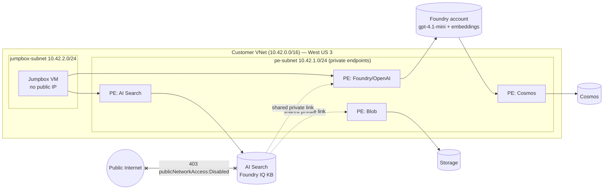
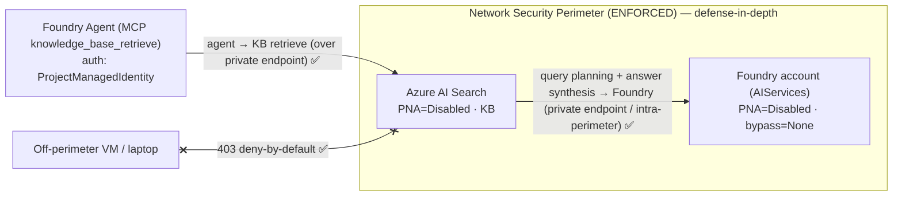

*A checklist-driven, auditor-ready blueprint for running Foundry IQ and the Foundry Agent Service with **zero public data plane**.*

Regulated enterprises — electric utilities under **NERC CIP**, government, financial services, oil & gas — want the productivity of Foundry IQ (Azure AI Search **Knowledge Bases**) and the Foundry Agent Service that consumes them over **MCP**, but only if the entire AI data plane stays **inside the customer VNet**. No public endpoints. No keys. No exceptions.

This guide does not merely *describe* that architecture — it **proves** it. Every command, payload, and output below was executed against a **real Azure deployment** in West US 3, and the result of each step is captured as one of **9 acceptance criteria (AC1–AC9)**.

> **What you'll be able to tell your auditor:** *"The Foundry IQ Knowledge Base and the agent that queries it run entirely on private endpoints inside our VNet. We have an executed test that proves the identical data-plane calls succeed on the in-VNet jumpbox and fail with HTTP 403 from anywhere outside the network."*

The sample workload is **Contoso Grid**, a fictional ISO/utility. Its knowledge base grounds on NERC CIP access-control policy, a SCADA network-segmentation standard, a substation incident-response runbook, and control-room operating procedures.

### Architecture



## Choose your isolation model — BYO VNet vs. Managed VNet

Microsoft offers **two recommended ways** to network-isolate the Foundry Agent Service. Both are best-practice — they differ in *who builds and operates the network*. Pick deliberately before you provision, because the choice is hard to reverse.

| | **BYO VNet** *(this guide)* | **Managed VNet** *(Appendix A)* |
|---|---|---|
| Who builds & operates the network | **You**: VNet, delegated agent subnet, PE subnet, private DNS zones, IP sizing | **Microsoft** — the managed network and its private endpoints are provisioned and operated for you (managed PEs have **no NIC** in your subscription) |
| Exfiltration control | Your NSGs / your Azure Firewall | Built-in **"Allow Only Approved Outbound"** (service tags + private endpoints + optional FQDN rules) enforced by a **managed Azure Firewall** |
| Subnet sizing / IP-overlap planning | **Required** — `/24` agent subnet delegated to `Microsoft.App/environments`, RFC 1918 only, no overlap with peers | **Not your concern** — eliminates IP-overlap entirely |
| Create experience | ✅ Azure portal wizard + Bicep/Terraform | ⚠️ **No portal UI yet** — `az rest` / `az cognitiveservices` CLI / Bicep / Terraform only |
| Peering / on-prem hub / **bring-your-own firewall** | ✅ Full control | ⛔ Limited — on-prem via **Application Gateway**; **can't** bring your own firewall; outbound mode is **permanent** once set |
| Best for | **Strict network mandates** — NERC CIP, government, financial services, defense | **Low-friction** exfiltration protection when you don't need your own VNet |

**This guide implements BYO VNet end-to-end**, because the regulated grid / gov / FSI customers it targets typically mandate that agent compute runs inside *their* VNet, behind *their* firewall, reachable from *their* on-prem hub. If you don't carry that mandate and simply want exfiltration-protected isolation with the least effort, use **Managed VNet** — fewer moving parts, no subnet/IP planning, no jumpbox to build. See **Appendix A** for the Managed VNet path.

> ⚠️ **The part that's identical either way.** Network isolation for **Foundry IQ itself (Azure AI Search)** is the *same* in both models: you still set `publicNetworkAccess=Disabled`, add an **inbound private endpoint**, create **shared private links** to Blob + the Foundry/OpenAI account, and you still need an **in-VNet path (Azure Bastion)** to create and query Knowledge Bases. Managed VNet simplifies the **agent-compute** network — it does **not** remove the Search data-plane bootstrap (Steps 2–6 below). Budget for it regardless of which model you choose.

📚 Docs: [Set up private networking for Foundry Agent Service](https://learn.microsoft.com/azure/foundry/agents/how-to/virtual-networks) · [Deep dive into Foundry Agent Service networking](https://learn.microsoft.com/azure/foundry/agents/concepts/agents-networking-deep-dive) · [Configure managed virtual network](https://learn.microsoft.com/azure/ai-foundry/how-to/managed-virtual-network)

## How the isolation actually works — the two-context mental model

Once Azure AI Search has `publicNetworkAccess=Disabled` plus an inbound private endpoint, **your laptop (off-VNet) can no longer reach the data plane** — and *that failure is the proof of isolation*. So the work splits cleanly into two contexts:

- **Off-VNet (control plane):** everything that goes through Azure Resource Manager (ARM). Bicep deployment, model deployments, RBAC role assignments, shared private link create + approve, the project connection, and — critically — the **negative isolation tests**. ARM has its own public control endpoint, so these run fine from anywhere.
- **In-VNet jumpbox (data plane):** anything that hits the service data plane directly — create index / knowledge sources / knowledge base, run retrieve, and the agent-over-MCP calls. These **only** work from inside the VNet.

Keep this split in mind for every cell below: the cell header notes whether it runs **off-VNet (ARM)** or **on the jumpbox (data plane)**.

### Acceptance criteria summary (verified results)

| AC | What it proves | Result |
|---|---|---|
| AC1 | Inbound public access OFF (`publicNetworkAccess=Disabled`, PE Approved) | ✅ PASS |
| AC2 | Private DNS: FQDNs resolve to 10.42.x.x from jumpbox; 443 open | ✅ PASS |
| AC3 | Outbound over shared private links; blob indexer ran private, 3 docs | ✅ PASS |
| AC4 | Least-privilege RBAC present (MIs + Cosmos data-plane role) | ✅ PASS |
| AC5 | Index + 2 knowledge sources + KB created over the private data plane | ✅ PASS |
| AC6 | KB retrieval returns grounded, cited answers | ✅ PASS |
| AC7 | Foundry Agent answers over the KB **via MCP**, grounded + cited | ✅ PASS |
| AC8 | Same data-plane calls from OFF the VNet fail with **403** | ✅ PASS |
| AC9 | Portal UX (ai.azure.com) over Bastion: build KS/KB + use in Agent playground | 📋 walkthrough |

## Prerequisites checklist

- [ ] Azure subscription with **Owner** or **Contributor** **and** **User Access Administrator** (you assign roles).
- [ ] Azure CLI **`az >= 2.60`** with the Search extension: `az extension add --name search`.
- [ ] Resource providers registered (next cell): KeyVault, CognitiveServices, Storage, MachineLearningServices, Search, Network, App, DocumentDB.
- [ ] **Quota in West US 3** for: Azure AI Search (Standard), Cosmos DB, the Azure OpenAI deployments (`text-embedding-3-large`, `gpt-4.1-mini`), and VM cores (`Standard_D2s_v5`).
- [ ] A tenant policy that **allows private endpoints** (some orgs deny them by Azure Policy — clear this with your platform team first).
- [ ] Azure Bastion permitted in the VNet (you'll reach the no-public-IP jumpbox through it for the portal walkthrough in AC9).

```python
# Context: OFF-VNET (control plane / ARM). Run from your admin workstation.
for p in Microsoft.KeyVault Microsoft.CognitiveServices Microsoft.Storage \
         Microsoft.MachineLearningServices Microsoft.Search Microsoft.Network \
         Microsoft.App Microsoft.DocumentDB; do
  az provider register --namespace $p
done
az group create -n rg-foundryiq-isolated-wus3 -l westus3
```

## Step 1 — Provision the private foundation with the official Bicep

Don't hand-roll the network. Use the official Microsoft **foundry-samples** *"Network Secured Standard Agent Setup"* (sample `15-network-secured-agent`). In one deployment it creates:

- The **Foundry account + project**, **AI Search**, **Storage**, and **Cosmos DB**.
- **Private endpoints + private DNS zones** for every service.
- The **VNet** with `pe-subnet` (private endpoints) and `agent-subnet` (delegated to the agent runtime).
- The **BYO connections** (Search / Storage / Cosmos) and the **capability host** that makes the project an isolated agent host.

Source (verified): <https://github.com/azure-ai-foundry/foundry-samples/tree/main/samples/microsoft/infrastructure-setup/15-network-secured-agent>

It wires **6 private DNS zones** — confirm all six exist after deployment:

```text
privatelink.services.ai.azure.com
privatelink.openai.azure.com
privatelink.cognitiveservices.azure.com
privatelink.search.windows.net
privatelink.blob.core.windows.net
privatelink.documents.azure.com
```

> 📸 **Screenshot placeholder:** `media/network-isolated-foundry-iq/01-bicep-deployment-succeeded.png` — *Resource group deployment "Succeeded" in the portal.*

```python
# Context: OFF-VNET (control plane / ARM).
# main.bicepparam (key values)
#   location         = 'westus3'
#   aiServices       = 'foundryiq'        # account name prefix
#   modelName        = 'gpt-4.1-mini'     # agent model
#   modelCapacity    = 100
#   firstProjectName = 'proj'
#   peSubnetName     = 'pe-subnet'
#   agentSubnetName  = 'agent-subnet'
# Private DNS zones + the 6 zone names are declared in the param file.

az deployment group create \
  -g rg-foundryiq-isolated-wus3 \
  -f main.bicep -p main.bicepparam \
  --name foundryiq-isolated
```

> ⚠️ **Field note (the single most common stumbling block).** Standard Agent VNet injection takes **~45–60 minutes**. The **account capability host** sub-deployment frequently reports `InternalServerError` in the ARM long-running operation **even though the resource actually succeeded**. Do **not** assume failure. Verify the real provisioning state, and if the *project* capability host is missing, (re)create it directly with an idempotent PUT (next cell).

```python
# Context: OFF-VNET (control plane / ARM).
# 1) Confirm the ACCOUNT capability host actually succeeded despite any ARM LRO error:
az rest --method get --url \
 "https://management.azure.com/subscriptions/<SUBSCRIPTION_ID>/resourceGroups/rg-foundryiq-isolated-wus3/providers/Microsoft.CognitiveServices/accounts/foundryiqlltu/capabilityHosts?api-version=2025-04-01-preview" \
 --query "value[].{name:name, state:properties.provisioningState}" -o table

# 2) Create the PROJECT capability host with the 3 BYO connections (idempotent PUT):
az rest --method put --url \
 "https://management.azure.com/subscriptions/<SUBSCRIPTION_ID>/resourceGroups/rg-foundryiq-isolated-wus3/providers/Microsoft.CognitiveServices/accounts/foundryiqlltu/projects/projlltu/capabilityHosts/caphostproj?api-version=2025-04-01-preview" \
 --body '{
   "properties": {
     "capabilityHostKind": "Agents",
     "vectorStoreConnections": ["foundryiqlltusearch"],
     "storageConnections":     ["foundryiqlltust"],
     "threadStorageConnections":["foundryiqlltucosmosdb"]
   }
 }'
```

**Verified output** — the project capability host reaches a terminal success state:

```text
caphostproj   provisioningState: Succeeded
```

```python
# Context: OFF-VNET (control plane / ARM).
# Embedding model used by the knowledge sources (dim 3072):
az cognitiveservices account deployment create -g rg-foundryiq-isolated-wus3 -n foundryiqlltu \
  --deployment-name text-embedding-3-large --model-name text-embedding-3-large \
  --model-version 1 --model-format OpenAI --sku-name GlobalStandard --sku-capacity 50

# Semantic ranking: the CLI flag is unreliable; set it via the mgmt API (free tier):
az rest --method patch --url \
 "https://management.azure.com/subscriptions/<SUBSCRIPTION_ID>/resourceGroups/rg-foundryiq-isolated-wus3/providers/Microsoft.Search/searchServices/foundryiqlltusearch?api-version=2024-03-01-preview" \
 --body '{"properties":{"semanticSearch":"free"}}'
```

## Step 2 — Lock down inbound, then prove it (AC1)

The first acceptance criterion is the most fundamental: the AI Search service must reject all inbound traffic from the public internet. Two conditions must hold:

1. `publicNetworkAccess = Disabled` on the search service.
2. The inbound private endpoint (groupId `searchService`) is in state **Approved**.

The next cell reads both directly from ARM.

```python
# Context: OFF-VNET (control plane / ARM).
az search service show -n foundryiqlltusearch -g rg-foundryiq-isolated-wus3 \
  --query "{publicNetworkAccess:publicNetworkAccess, status:status, sku:sku.name, semantic:semanticSearch}" -o json

az search private-endpoint-connection list --service-name foundryiqlltusearch \
  -g rg-foundryiq-isolated-wus3 \
  --query "[].{name:name, status:properties.privateLinkServiceConnectionState.status, group:properties.groupId}" -o json
```

**Verified output (quote exactly):**

```json
{ "publicNetworkAccess": "Disabled", "semantic": "free", "sku": "standard", "status": "running" }
```
```json
[ { "group": "searchService",
    "name": "foundryiqlltusearch-private-endpoint.f922aa8f-65ad-42ff-9057-cfa25b020375",
    "status": "Approved" } ]
```

> ### ✅ AC1 PASSED
> Inbound public access is **OFF** (`publicNetworkAccess: Disabled`) and the inbound private endpoint is **Approved**. The service can only be reached from inside the VNet.

## Step 3 — Outbound only over shared private links, then prove it (AC3)

Foundry IQ has to reach **out** to two services to do its job: **Blob storage** (to index the policy documents) and the **Foundry/OpenAI account** (for embeddings and answer synthesis). With public access disabled everywhere, those outbound calls must travel over **shared private links (SPLs)** — never the public internet. Two SPLs are required, and each must be **approved on the target resource**:

- `blob` → the storage account
- `openai_account` → the Foundry account

> ⚠️ **Field note (real gotcha).** `az search shared-private-link-resource create` uses an older API that **rejects `openai_account`** with: *"Supported types are: blob, table, dfs, file, Sql, sqlServer, vault."* Create the AOAI SPL with `az rest` against **`api-version=2025-05-01`** instead. The blob SPL works fine through the CLI.

```python
# Context: OFF-VNET (control plane / ARM).
# blob SPL (CLI works):
az search shared-private-link-resource create --name spl-blob \
  --service-name foundryiqlltusearch -g rg-foundryiq-isolated-wus3 \
  --group-id blob \
  --resource-id "/subscriptions/<SUBSCRIPTION_ID>/resourceGroups/rg-foundryiq-isolated-wus3/providers/Microsoft.Storage/storageAccounts/foundryiqlltust" \
  --request-message "Foundry IQ private blob indexing"

# openai_account SPL (must use az rest + 2025-05-01):
az rest --method put --url \
 "https://management.azure.com/subscriptions/<SUBSCRIPTION_ID>/resourceGroups/rg-foundryiq-isolated-wus3/providers/Microsoft.Search/searchServices/foundryiqlltusearch/sharedPrivateLinkResources/spl-aoai?api-version=2025-05-01" \
 --body '{"properties":{"privateLinkResourceId":"/subscriptions/<SUBSCRIPTION_ID>/resourceGroups/rg-foundryiq-isolated-wus3/providers/Microsoft.CognitiveServices/accounts/foundryiqlltu","groupId":"openai_account","requestMessage":"Foundry IQ private AOAI"}}'

# Approve both PE connections on the targets:
az network private-endpoint-connection approve --description "approved" \
  --resource-name foundryiqlltust --type Microsoft.Storage/storageAccounts \
  -g rg-foundryiq-isolated-wus3 --name <pe-conn-name>
az network private-endpoint-connection approve --description "approved" \
  --resource-name foundryiqlltu --type Microsoft.CognitiveServices/accounts \
  -g rg-foundryiq-isolated-wus3 --name <pe-conn-name>

# Verify both SPLs are Approved + Succeeded:
az rest --method get --url \
 "https://management.azure.com/subscriptions/<SUBSCRIPTION_ID>/resourceGroups/rg-foundryiq-isolated-wus3/providers/Microsoft.Search/searchServices/foundryiqlltusearch/sharedPrivateLinkResources?api-version=2025-05-01" \
 --query "value[].{name:name, groupId:properties.groupId, status:properties.status, provisioningState:properties.provisioningState}" -o json
```

**Verified output — both shared private links approved:**

```json
[ {"groupId":"blob","name":"spl-blob","provisioningState":"Succeeded","status":"Approved"},
  {"groupId":"openai_account","name":"spl-aoai","provisioningState":"Succeeded","status":"Approved"} ]
```

And the blob indexer that later ran over that private path (captured during the data-plane build in Step 6):

```json
{ "name": "grid-policy-ks-indexer",
  "lastResult": { "status": "success", "itemsProcessed": 3, "itemsFailed": 0,
                  "mode": "indexingAllDocs", "errors": [], "warnings": [] } }
```

> ### ✅ AC3 PASSED
> Outbound traffic runs only over **approved** private links; the blob indexer processed **3 documents with 0 errors** without ever touching the public internet.

> 📸 **Screenshot placeholder:** `media/network-isolated-foundry-iq/02-shared-private-link-approved.png` — *Shared private link connections "Approved" on the storage and Foundry accounts.*

## Step 4 — Least-privilege RBAC, no keys anywhere (AC4)

Keys are disabled across the stack; every component authenticates with a **managed identity** and the **minimum** roles it needs:

- **Search MI** reads the blob container and calls the Foundry/OpenAI account.
- **Project MI** reads/writes Search, Storage, and Cosmos — including the **Cosmos SQL data-plane** role, which is easy to miss.
- **Jumpbox MI** lets the admin run the data-plane scripts (Steps 6–7) without any keys.

> ⚠️ **Field note (real gotcha).** When the capability-host deployment is cancelled or errors mid-flight, the Cosmos **SQL data-plane** role assignment is silently skipped. The agent then fails later with a Cosmos **403 (readMetadata)**. Assign the built-in **Cosmos DB Built-in Data Contributor** (`...0002`) explicitly — see the last command below.

```python
# Context: OFF-VNET (control plane / ARM).
SEARCH_MI=0ed187f2-0881-491b-ad3a-bd58290b108b
PROJ_MI=7ccd6538-1068-4c1b-9df5-61808bb9a0b2
JUMP_MI=c7b979cd-eaf2-445a-ba0e-2eadad9d0c9d
ST="/subscriptions/<SUBSCRIPTION_ID>/resourceGroups/rg-foundryiq-isolated-wus3/providers/Microsoft.Storage/storageAccounts/foundryiqlltust"
AC="/subscriptions/<SUBSCRIPTION_ID>/resourceGroups/rg-foundryiq-isolated-wus3/providers/Microsoft.CognitiveServices/accounts/foundryiqlltu"
SR="/subscriptions/<SUBSCRIPTION_ID>/resourceGroups/rg-foundryiq-isolated-wus3/providers/Microsoft.Search/searchServices/foundryiqlltusearch"

# search MI:
az role assignment create --assignee $SEARCH_MI --role "Storage Blob Data Reader" --scope $ST
az role assignment create --assignee $SEARCH_MI --role "Cognitive Services User"  --scope $AC

# project MI: Search Index Data Contributor, Search Service Contributor,
#             Storage Blob Data Contributor, Cosmos DB Operator (control plane)
# jumpbox MI: the above on Search/Storage + Cognitive Services User + Foundry User + Foundry Project Manager

# Cosmos SQL DATA-PLANE role (the gotcha): Built-in Data Contributor (id ...0002)
az cosmosdb sql role assignment create --account-name foundryiqlltucosmosdb \
  -g rg-foundryiq-isolated-wus3 \
  --role-definition-id 00000000-0000-0000-0000-000000000002 \
  --principal-id $PROJ_MI --scope "/"
```

**Verified RBAC matrix:**

| Principal | Role | Scope |
|---|---|---|
| search-mi | Storage Blob Data Reader | storage account |
| search-mi | Cognitive Services User | Foundry account |
| project-mi | Storage Blob Data Contributor | storage account |
| project-mi | Search Index Data Contributor | search service |
| project-mi | Search Service Contributor | search service |
| project-mi | Cosmos DB Operator | Cosmos account (control plane) |
| project-mi | **Cosmos SQL Built-in Data Contributor (`...0002`)** | Cosmos `/` (data plane) |
| jumpbox-mi | Search Index Data Contributor | search service |
| jumpbox-mi | Search Service Contributor | search service |
| jumpbox-mi | Storage Blob Data Contributor | storage account |
| jumpbox-mi | Cognitive Services User | Foundry account |
| jumpbox-mi | Foundry Project Manager | Foundry account |
| jumpbox-mi | Foundry User | Foundry account |

> ### ✅ AC4 PASSED
> Least-privilege assignments are present for all three managed identities (including the easily-missed Cosmos SQL data-plane role). **No API keys are used anywhere.**

## Step 5 — The jumpbox is your data-plane workstation, then prove DNS (AC2)

The jumpbox VM has **no public IP** and **no inbound ports open**. Per Azure best practice, the **recommended way for a human admin to reach it is Azure Bastion** — browser-based RDP/SSH with no public IP and nothing exposed to the internet — or a site-to-site **VPN / ExpressRoute** from your corporate network. From that in-VNet session you run every data-plane step in Steps 6–7 against the private endpoints, using the VM's **system-assigned managed identity** — no keys anywhere.

> 💡 **Why a jumpbox at all, and why Bastion?** Once Search has `publicNetworkAccess=Disabled`, *some* host inside the VNet must issue the data-plane calls (create KB/KS, retrieve, build the agent). A **Bastion-reached jumpbox** is the standard, auditable answer and the recommended developer experience. In this notebook the scripts are instead delivered unattended via `az vm run-command invoke` purely so the walkthrough is **fully reproducible end-to-end** — that's an automation convenience, **not** the interactive DX we recommend. For day-to-day work: connect over Bastion and run these same scripts in a terminal on the box.

Before building anything, prove the routing: every service FQDN must resolve to a **private 10.42.1.x** address (via the private DNS zones) and accept TCP 443.


```python
# Context: provisioning runs OFF-VNET (ARM); the DNS loop runs ON the jumpbox via run-command.
az network vnet subnet create -g rg-foundryiq-isolated-wus3 --vnet-name foundryiq-vnet \
  -n jumpbox-subnet --address-prefixes 10.42.2.0/24
az vm create -g rg-foundryiq-isolated-wus3 -n foundryiq-jump --image Ubuntu2204 \
  --vnet-name foundryiq-vnet --subnet jumpbox-subnet --public-ip-address "" \
  --assign-identity --size Standard_D2s_v5 --admin-username azureuser --generate-ssh-keys

# From the jumpbox (via run-command): resolve the FQDNs — expect private 10.42.x.x
for fqdn in foundryiqlltusearch.search.windows.net foundryiqlltu.openai.azure.com \
            foundryiqlltust.blob.core.windows.net foundryiqlltucosmosdb.documents.azure.com; do
  getent hosts "$fqdn"
done
```

**Verified output (from the jumpbox):**

```text
foundryiqlltusearch.search.windows.net    -> 10.42.1.10
foundryiqlltu.openai.azure.com            -> 10.42.1.6
foundryiqlltu.cognitiveservices.azure.com -> 10.42.1.5
foundryiqlltust.blob.core.windows.net     -> 10.42.1.4
foundryiqlltucosmosdb.documents.azure.com -> 10.42.1.8
TCP 443: search OPEN, openai OPEN, blob OPEN
```

> ### ✅ AC2 PASSED
> Every endpoint resolves to a private **10.42.1.x** address via the private DNS zones, and 443 is reachable. The data plane lives inside the VNet.

## Step 6 — Build the Knowledge Base over the private data plane (AC5 / AC6)

Now the data plane. From the jumpbox (managed identity, no keys) we:

1. Upload the 3 NERC/grid policy docs to the **private** blob container.
2. Build a **Blob (Indexed) knowledge source** — Foundry IQ auto-creates the indexer pipeline and pulls the docs over the blob shared private link.
3. Build a **Search Index knowledge source** for the control-room operating procedures.
4. Compose a unified **Knowledge Base** (`outputMode=answerSynthesis`, `retrievalReasoningEffort=medium`, `gpt-4.1-mini`).

> ⚠️ **Field notes (hard-won).**
> - **Blob KS extraction:** use `contentExtractionMode: "minimal"` — `standard` requires a Content Understanding resource *and its own* shared private link. With `disableImageVerbalization: true` you **must omit** `chatCompletionModel` and keep only `embeddingModel`.
> - **MI auth (no keys):** use `connectionString: "ResourceId=<storageRID>;"`.
> - **KB sources:** list `knowledgeSources: [{name: ...}]` only — do **not** add `includeReferenceSourceData` (invalid here).
> - **Accept HTTP 200 / 201 / 204** on PUT updates.

Auth scopes used by the data-plane scripts: `https://search.azure.com/.default` (Search) and `https://cognitiveservices.azure.com/.default` (Foundry/OpenAI). Run them on the jumpbox with `ManagedIdentityCredential`.

```python
# Context: ON THE JUMPBOX (data plane). upload_docs.py — Entra ID only; shared-key auth is disabled.
import os, pathlib, urllib.request, urllib.error
from azure.identity import ManagedIdentityCredential

ACCOUNT = os.environ["STORAGE_ACCOUNT"]                 # foundryiqlltust
CONTAINER = os.environ.get("BLOB_CONTAINER", "grid-policies")
ENDPOINT = f"https://{ACCOUNT}.blob.core.windows.net"
HERE = pathlib.Path(__file__).resolve().parent / "data"  # the 3 *.md grid policies
cred = ManagedIdentityCredential()
VER = "2021-08-06"

def tok():
    return cred.get_token("https://storage.azure.com/.default").token

def put(url, data, extra):
    h = {"Authorization": f"Bearer {tok()}", "x-ms-version": VER, **extra}
    r = urllib.request.Request(url, data=data, headers=h, method="PUT")
    try:
        with urllib.request.urlopen(r, timeout=60) as resp:
            return resp.status
    except urllib.error.HTTPError as e:
        body = e.read().decode()[:200]
        if e.code == 409:  # container already exists
            return 409
        raise SystemExit(f"PUT {url} failed: {e.code} {body}")

print(put(f"{ENDPOINT}/{CONTAINER}?restype=container", b"", {}), "container", CONTAINER)
for f in sorted(HERE.glob("*.md")):
    data = f.read_bytes()
    code = put(f"{ENDPOINT}/{CONTAINER}/{f.name}", data,
               {"x-ms-blob-type": "BlockBlob", "Content-Type": "text/markdown"})
    print(code, "uploaded", f.name, f"({len(data)} bytes)")
print("UPLOAD DONE")
```

```python
# Context: ON THE JUMPBOX (data plane). Excerpt of run_e2e.py — verified payloads.
import json, os, time, pathlib, urllib.request, urllib.error
from azure.identity import ManagedIdentityCredential

API = "2025-11-01-preview"
AOAI_API = "2024-10-21"
SEARCH = os.environ["SEARCH_ENDPOINT"].rstrip("/")           # https://foundryiqlltusearch.search.windows.net
AOAI = os.environ["FOUNDRY_OPENAI_ENDPOINT"].rstrip("/")     # https://foundryiqlltu.openai.azure.com
EMBED_DEPLOY = EMBED_MODEL = "text-embedding-3-large"
CHAT_DEPLOY = CHAT_MODEL = "gpt-4.1-mini"
STORAGE_RID = os.environ["STORAGE_RESOURCE_ID"]
CONTAINER = "grid-policies"
VECTOR_DIM = 3072
INDEX_NAME, SEARCHINDEX_KS, BLOB_KS, KB_NAME = "control-room-index", "control-room-ks", "grid-policy-ks", "contoso-grid-kb"

cred = ManagedIdentityCredential()
def tok(scope): return cred.get_token(scope).token
def search_hdr(): return {"Content-Type": "application/json", "Authorization": f"Bearer {tok('https://search.azure.com/.default')}"}
def aoai_hdr():   return {"Content-Type": "application/json", "Authorization": f"Bearer {tok('https://cognitiveservices.azure.com/.default')}"}

def req(method, url, headers, body=None):
    data = json.dumps(body).encode() if body is not None else None
    r = urllib.request.Request(url, data=data, headers=headers, method=method)
    try:
        with urllib.request.urlopen(r, timeout=120) as resp:
            raw = resp.read().decode(); return resp.status, (json.loads(raw) if raw else {})
    except urllib.error.HTTPError as e:
        raw = e.read().decode()
        try: return e.code, json.loads(raw)
        except Exception: return e.code, {"raw": raw}

# --- A. Search Index knowledge source (control-room procedures) ---
index_def = {
    "name": INDEX_NAME,
    "fields": [
        {"name": "id", "type": "Edm.String", "key": True, "filterable": True},
        {"name": "title", "type": "Edm.String", "searchable": True, "retrievable": True},
        {"name": "category", "type": "Edm.String", "filterable": True, "retrievable": True},
        {"name": "content", "type": "Edm.String", "searchable": True, "retrievable": True},
        {"name": "content_vector", "type": "Collection(Edm.Single)", "searchable": True,
         "dimensions": VECTOR_DIM, "vectorSearchProfile": "vprofile"},
    ],
    "vectorSearch": {
        "algorithms": [{"name": "hnsw", "kind": "hnsw"}],
        "profiles": [{"name": "vprofile", "algorithm": "hnsw"}],
    },
    "semantic": {"configurations": [{
        "name": "sem",
        "prioritizedFields": {
            "titleField": {"fieldName": "title"},
            "prioritizedContentFields": [{"fieldName": "content"}],
            "prioritizedKeywordsFields": [{"fieldName": "category"}],
        }}]},
}
req("PUT", f"{SEARCH}/indexes/{INDEX_NAME}?api-version={API}", search_hdr(), index_def)
# ... embed + upload control-room docs (POST /indexes/{INDEX_NAME}/docs/index) ...
ks_search = {
    "name": SEARCHINDEX_KS, "kind": "searchIndex",
    "description": "Contoso Grid control-room operating procedures (existing index).",
    "searchIndexParameters": {
        "searchIndexName": INDEX_NAME,
        "semanticConfigurationName": "sem",
        "sourceDataFields": [{"name": "title"}, {"name": "category"}, {"name": "content"}],
        "searchFields": [{"name": "content"}, {"name": "title"}],
    },
}
req("PUT", f"{SEARCH}/knowledgesources/{SEARCHINDEX_KS}?api-version={API}", search_hdr(), ks_search)

# --- B. Blob (Indexed) knowledge source via shared private link (auto pipeline) ---
aoai_params = {"resourceUri": AOAI, "deploymentId": None, "modelName": None, "authIdentity": None, "apiKey": None}
ks_blob = {
    "name": BLOB_KS, "kind": "azureBlob",
    "description": "Contoso Grid NERC CIP policies and substation runbooks (private blob).",
    "azureBlobParameters": {
        "connectionString": f"ResourceId={STORAGE_RID};",   # MI auth, no keys
        "containerName": CONTAINER,
        "isADLSGen2": False,
        "ingestionParameters": {
            "identity": None,
            "disableImageVerbalization": True,
            "contentExtractionMode": "minimal",             # NOT "standard"
            "embeddingModel": {"kind": "azureOpenAI", "azureOpenAIParameters":
                {**aoai_params, "deploymentId": EMBED_DEPLOY, "modelName": EMBED_MODEL}},
            # NOTE: chatCompletionModel is intentionally OMITTED (image verbalization disabled)
        },
    },
}
req("PUT", f"{SEARCH}/knowledgesources/{BLOB_KS}?api-version={API}", search_hdr(), ks_blob)
# ... poll {BLOB_KS}-indexer /status until lastResult.status == "success" ...

# --- C. Unified Knowledge Base (answer synthesis, gpt-4.1-mini) ---
kb = {
    "name": KB_NAME,
    "description": "Contoso Grid operations knowledge base: NERC CIP policies, substation runbooks, and control-room procedures.",
    "knowledgeSources": [{"name": BLOB_KS}, {"name": SEARCHINDEX_KS}],   # names only
    "models": [{"kind": "azureOpenAI", "azureOpenAIParameters":
                {"resourceUri": AOAI, "deploymentId": CHAT_DEPLOY, "modelName": CHAT_MODEL, "authIdentity": None}}],
    "outputMode": "answerSynthesis",
    "retrievalReasoningEffort": {"kind": "medium"},
    "retrievalInstructions": "Use the grid-policy source for compliance and incident-response questions; use the control-room source for real-time operating procedures.",
    "answerInstructions": "Answer concisely for a control-room operator. Always cite the source.",
}
req("PUT", f"{SEARCH}/knowledgebases/{KB_NAME}?api-version={API}", search_hdr(), kb)
```

> ### ✅ AC5 PASSED
> The index, the **`grid-policy-ks`** (blob) knowledge source, the **`control-room-ks`** (search index) knowledge source, and the unified **`contoso-grid-kb`** Knowledge Base were all created over the **private** data plane from the jumpbox.

```python
# Context: ON THE JUMPBOX (data plane). Excerpt of run_e2e.py — KB retrieve.
def retrieve(question):
    payload = {"messages": [
        {"role": "assistant", "content": [{"type": "text",
            "text": "You answer Contoso Grid operations questions. Cite the source for every fact. If unknown, say 'I do not know'."}]},
        {"role": "user", "content": [{"type": "text", "text": question}]},
    ]}
    st, body = req("POST", f"{SEARCH}/knowledgebases/{KB_NAME}/retrieve?api-version={API}", search_hdr(), payload)
    answer = body["response"][0]["content"][0]["text"]
    refs = body.get("references", [])
    activity = body.get("activity", [])
    return answer, refs, activity

for q in [
    "How often must a personnel risk assessment be reviewed, and what happens to access when someone is terminated?",
    "Which substation is black-start priority 1 and why?",
    "What does the operator do when frequency drops below 59.95 Hz?",
]:
    answer, refs, activity = retrieve(q)
    print(f"\nQ: {q}\nA: {answer}\n   references: {len(refs)}")
```

**Verified Q&A (real retrieve outputs, grounded + cited):**

> **Q:** *How often must a personnel risk assessment be reviewed, and what happens to access when someone is terminated?*
>
> **A:** "According to Contoso Grid policies, a Personnel Risk Assessment (PRA) must be reviewed at least once every **15 calendar months** [ref_id:0]. When someone is terminated, their electronic access to BES Cyber Systems must be revoked **within 24 hours** of the termination [ref_id:0]."
> — **1 reference** → `nerc-cip-access-control-policy.md` (source `grid-policy-ks`)

> **Q:** *What does the operator do when frequency drops below 59.95 Hz?*
>
> **A:** "When the grid frequency drops below 59.95 Hz, the control room operator immediately initiates **Load Shed Block A**, which sheds approximately **150 MW** of interruptible industrial load. If the frequency continues to fall below **59.90 Hz within 30 seconds**, **Load Shed Block B is armed** automatically. All load shed actions must be logged in the operations journal and reported to the Regional Transmission Operator within 15 minutes [ref_id:0]."
> — **2 references** (source `control-room-ks`)

The `activity` trace proves the full agentic pipeline ran for each answer:

```text
modelQueryPlanning → azureBlob / searchIndex (knowledge source queries) → agenticReasoning (medium) → modelAnswerSynthesis
```

> ### ✅ AC6 PASSED
> Answers are grounded with **≥1 citation** and carry a complete agentic activity trace — over the private data plane.

## Step 7 — Connect a Foundry Agent over MCP (AC7)

Foundry IQ exposes each Knowledge Base as an **MCP endpoint**. The canonical v2 pattern (see <https://learn.microsoft.com/azure/foundry/agents/how-to/foundry-iq-connect>) is:

1. Create a **RemoteTool** project connection that authenticates with `ProjectManagedIdentity` and targets the KB MCP endpoint, with `audience = https://search.azure.com/`.
2. Create an agent and attach an **MCPTool** with `allowed_tools=["knowledge_base_retrieve"]`, pointing at the connection.

> ℹ️ **Field note.** This RemoteTool/connection pattern works for **CognitiveServices (Foundry) projects** too — not just hub-based projects. The MCP endpoint is `{search}/knowledgebases/{kb}/mcp?api-version=2025-11-01-preview`.

```python
# Context: ON THE JUMPBOX (data plane). run_agent.py — connection + agent + invoke.
import json, os, pathlib, requests
from azure.identity import ManagedIdentityCredential, get_bearer_token_provider
from azure.ai.projects import AIProjectClient
from azure.ai.projects.models import PromptAgentDefinition, MCPTool

SEARCH = os.environ["SEARCH_ENDPOINT"].rstrip("/")
KB_NAME = os.environ.get("KB_NAME", "contoso-grid-kb")
PROJECT_ENDPOINT = os.environ["PROJECT_ENDPOINT"]      # https://foundryiqlltu.services.ai.azure.com/api/projects/projlltu
PROJECT_RID = os.environ["PROJECT_RESOURCE_ID"]
AGENT_MODEL = os.environ.get("CHAT_DEPLOYMENT", "gpt-4.1-mini")
CONN = os.environ.get("CONN_NAME", "contoso-grid-kb-mcp")
AGENT = os.environ.get("AGENT_NAME", "contoso-grid-assistant")
MCP_ENDPOINT = f"{SEARCH}/knowledgebases/{KB_NAME}/mcp?api-version=2025-11-01-preview"

cred = ManagedIdentityCredential()

# 1) RemoteTool project connection (ARM)
mgmt = get_bearer_token_provider(cred, "https://management.azure.com/.default")
r = requests.put(
    f"https://management.azure.com{PROJECT_RID}/connections/{CONN}?api-version=2025-10-01-preview",
    headers={"Authorization": f"Bearer {mgmt()}"},
    json={"name": CONN, "properties": {
        "authType": "ProjectManagedIdentity", "category": "RemoteTool",
        "target": MCP_ENDPOINT, "isSharedToAll": True,
        "audience": "https://search.azure.com/", "metadata": {"ApiType": "Azure"}}},
    timeout=60)
assert r.status_code in (200, 201), r.text

# 2) Agent with the knowledge_base_retrieve MCP tool
project = AIProjectClient(endpoint=PROJECT_ENDPOINT, credential=cred)
instructions = (
    "You are a Contoso Grid operations assistant. You must use the knowledge base tool to answer "
    "all questions and never answer from your own knowledge. Include citations for every fact. "
    "If the knowledge base does not contain the answer, respond with 'I don't know'.")
mcp_tool = MCPTool(server_label="knowledge-base", server_url=MCP_ENDPOINT,
                   require_approval="never", allowed_tools=["knowledge_base_retrieve"],
                   project_connection_id=CONN)
agent = project.agents.create_version(
    agent_name=AGENT,
    definition=PromptAgentDefinition(model=AGENT_MODEL, instructions=instructions, tools=[mcp_tool]))

# 3) Invoke via the Conversations/Responses API
oai = project.get_openai_client()
conv = oai.conversations.create()
question = "When must we revoke a terminated employee's access to BES cyber systems, and which substation is black-start priority 1?"
resp = oai.responses.create(conversation=conv.id, input=question,
                            extra_body={"agent_reference": {"name": agent.name, "type": "agent_reference"}})
print(resp.output_text)
```

**Verified RemoteTool connection (redacted):**

```json
{ "name": "contoso-grid-kb-mcp",
  "properties": { "authType": "ProjectManagedIdentity", "category": "RemoteTool",
    "audience": "https://search.azure.com/",
    "target": "https://foundryiqlltusearch.search.windows.net/knowledgebases/contoso-grid-kb/mcp?api-version=2025-11-01-preview",
    "metadata": {"ApiType": "Azure"} } }
```

**Agent answer (real):**

> "A terminated employee's access to BES cyber systems must be revoked **immediately upon termination** to ensure compliance with cybersecurity policies and prevent unauthorized access. The black-start priority 1 substation is **SS-12 (Riverside)**, which supplies power to the downtown medical district. This substation is critical and any SEV-1 incident affecting it triggers automatic escalation to the Regional Transmission Operator 【28:0†source】."

> ⚠️ **Field notes (real).** The agent first failed with a Cosmos **403** (missing the SQL data-plane role — see Step 4) and once with a transient **429** (resolved by raising `gpt-4.1-mini` to 100K TPM). After both fixes it returned the grounded, cited answer above.

> ### ✅ AC7 PASSED
> The Foundry Agent answered over the Knowledge Base **via MCP**, grounded and cited.

## Step 8 — Prove isolation from OFF the VNet (AC8)

This is the auditor's money shot. Run the **same** data-plane calls from the admin's laptop (off-VNet), with a **valid Entra token**. They must **fail with 403**. The identity and the token are valid — only the network path is different — so the failure isolates the network as the sole control. Run `negative_isolation_test.py` from your workstation (not the jumpbox).

```python
# Context: OFF-VNET (run from your laptop, NOT the jumpbox). negative_isolation_test.py
import socket, urllib.request, urllib.error, os
from azure.identity import AzureCliCredential

SEARCH = os.environ["SEARCH_ENDPOINT"].rstrip("/")
KB_NAME = os.environ.get("KB_NAME", "contoso-grid-kb")
API = "2025-11-01-preview"
cred = AzureCliCredential()

def call(label, url):
    host = url.split("/")[2]
    try: ip = socket.gethostbyname(host)
    except Exception as e: ip = f"dns-fail:{e}"
    tok = cred.get_token("https://search.azure.com/.default").token
    req = urllib.request.Request(url, headers={"Authorization": f"Bearer {tok}", "Content-Type": "application/json"})
    try:
        with urllib.request.urlopen(req, timeout=20) as r:
            code, note, isolated = r.status, "REACHED (unexpected for isolated service)", False
    except urllib.error.HTTPError as e:
        code, note, isolated = e.code, e.read().decode()[:160], e.code in (403, 401)
    except Exception as e:
        code, note, isolated = "timeout/err", str(e)[:160], True
    print(f"[{'ISOLATED' if isolated else 'EXPOSED  '}] {label}: public-resolved-ip={ip} status={code} :: {note}")
    return isolated

results = [
    call("Search data plane (list indexes)", f"{SEARCH}/indexes?api-version=2025-09-01"),
    call("Search data plane (list KBs)",      f"{SEARCH}/knowledgebases?api-version={API}"),
    call("KB retrieve endpoint",              f"{SEARCH}/knowledgebases/{KB_NAME}/retrieve?api-version={API}"),
]
print("\nAC8 " + ("PASSED — service is unreachable from off-VNet" if all(results) else "FAILED — service reachable from public internet"))
```

**Verified output (quote exactly):**

```text
[ISOLATED] Search data plane (list indexes): public-resolved-ip=4.227.75.183 status=403
   :: "Request is denied as the source is not allowed... 'publicNetworkAccess: Disabled'."
[ISOLATED] Search data plane (list KBs):     status=403  (same)
[ISOLATED] KB retrieve endpoint:             status=403  (same)
AC8 PASSED — service is unreachable from off-VNet
```

**Same identity, same token — only the network path differs:**

| Caller | Resolves to | TCP 443 | KB retrieve |
|---|---|---|---|
| **Jumpbox (in-VNet)** | `10.42.1.10` (private) | OPEN | **200** (grounded answer) |
| **Laptop (off-VNet)** | `4.227.75.183` (public) | — | **403 Disabled** |

> ### ✅ AC8 PASSED
> The data plane is genuinely private. Public callers get **403**, not data.

## Step 9 — Portal UX over Bastion (ai.azure.com) — AC9 walkthrough

`ai.azure.com` data-plane operations also traverse the private path, so the portal build must be done **from inside the VNet** — i.e., a browser running on the jumpbox, reached through Azure Bastion. These steps are the portal equivalent of AC5–AC7; capture redacted screenshots during your own run.

1. Connect to **`foundry-jump`** via **Azure Bastion** (RDP/SSH); open a browser to `https://ai.azure.com` from inside the VNet.
   - 📸 `media/network-isolated-foundry-iq/03-bastion-session.png`
2. Open the project → **Knowledge** → **+ Knowledge source** → pick **Azure Blob (Indexed)**, point at the private storage, choose `text-embedding-3-large`.
   - 📸 `media/network-isolated-foundry-iq/04-create-knowledge-source.png`
3. **+ Knowledge base** → add both sources → set **answer synthesis** + `gpt-4.1-mini`.
   - 📸 `media/network-isolated-foundry-iq/05-create-knowledge-base.png`
4. **Agents** → new agent → add the **Knowledge base (MCP)** tool → select `contoso-grid-kb`.
   - 📸 `media/network-isolated-foundry-iq/06-agent-add-kb-mcp-tool.png`
5. **Playground** → ask *"Which substation is black-start priority 1?"* → confirm a grounded answer with a citation.
   - 📸 `media/network-isolated-foundry-iq/07-agent-playground-grounded-answer.png`

> ### 📋 AC9 — walkthrough
> These steps are the portal equivalent of AC5–AC7. The image references above are **placeholders** — replace them with your own redacted captures taken during the Bastion session.

## Troubleshooting — the real issues we hit

| Symptom | Root cause | Fix |
|---|---|---|
| Capability host reports `InternalServerError` in the ARM LRO | Known long-running-operation reporting quirk; the resource often **actually succeeded** | Verify provisioning state directly; if the *project* caphost is missing, PUT `caphostproj` (Step 1, repair cell) |
| Agent fails with Cosmos **403 (readMetadata)** | Cosmos **SQL data-plane** role skipped when caphost deploy was cancelled | Assign **Cosmos DB Built-in Data Contributor** (`...0002`) to the project MI (Step 4) |
| Agent returns transient **429** | `gpt-4.1-mini` TPM too low | Raise the deployment to **100K TPM** |
| `openai_account` SPL rejected by CLI | `az search shared-private-link-resource create` uses an older API | Create the AOAI SPL via `az rest` with **`api-version=2025-05-01`** (Step 3) |
| Blob KS create fails / needs extra resource | `contentExtractionMode: "standard"` needs a Content Understanding resource + its own SPL | Use `contentExtractionMode: "minimal"` |
| Blob KS rejects body | `chatCompletionModel` sent while image verbalization disabled | **Omit** `chatCompletionModel`; keep only `embeddingModel` |
| Semantic ranking won't enable via CLI flag | CLI flag is unreliable | Set `semanticSearch: "free"` via the mgmt API `2024-03-01-preview` (Step 1) |
| Data-plane calls fail **403** from your laptop | **Expected** — `publicNetworkAccess: Disabled` | Run data-plane work from the in-VNet jumpbox (this 403 is AC8) |

## Cleanup

Once the audit evidence is captured, tear everything down to stop billing:

```bash
az group delete -n rg-foundryiq-isolated-wus3 --yes --no-wait
```

## Appendix A — The easier alternative: Managed VNet

If you do **not** need to operate your own VNet, **Managed VNet** is the lower-friction recommended path. It *"streamlines and automates network isolation for your Foundry resource by provisioning a Microsoft-managed virtual network that secures the Agents service underlying compute"* — you get a secure default without building or maintaining a VNet, subnets, DNS zones, or a jumpbox-as-agent-host. Managed private endpoints are abstracted away: **they create no customer-visible NICs** in your subscription.

> The CLI below is reproduced from **Microsoft Learn** and the official `foundry-samples` (sample 18). Unlike Steps 1–9 of this guide, it was **not executed against our Contoso Grid deployment** — treat it as the documented happy-path for the Managed VNet model.

### Outbound isolation modes

| Mode | What it does | Use when |
|---|---|---|
| **Allow Internet Outbound** | All outbound traffic to the internet is allowed | Broad connectivity acceptable |
| **Allow Only Approved Outbound** | Restricts outbound to service tags + private endpoints + optional FQDN rules (ports 80/443), enforced by a **managed Azure Firewall** | **Most secure** — minimize data-exfiltration risk |

> ⚠️ **The mode is permanent.** Once you set Allow Internet Outbound *or* Allow Only Approved Outbound you **cannot** change it, you **cannot** disable Managed VNet after enabling it, and there is **no upgrade path from BYO VNet → Managed VNet** — a Foundry resource redeployment is required. There is **no Azure portal create UI yet** (CLI / `az rest` / Bicep / Terraform only). You **can't** bring your own firewall, and each account gets (and pays for) its own managed firewall in Approved-Outbound mode.

### Deploy (Azure CLI / `az rest`, from Microsoft Learn)

```azurecli
# 1) Create the AIServices account WITH the managed-network injection. networkInjections,
#    customSubDomainName, and allowProjectManagement must be set AT CREATION TIME.
az rest --method PUT \
  --url "https://management.azure.com/subscriptions/<SUBSCRIPTION_ID>/resourceGroups/<rg>/providers/Microsoft.CognitiveServices/accounts/<account>?api-version=2026-03-01" \
  --body '{
    "location": "<region>", "kind": "AIServices", "sku": {"name": "S0"},
    "identity": {"type": "SystemAssigned"},
    "properties": {
      "allowProjectManagement": true,
      "customSubDomainName": "<account>",
      "networkInjections": [{"scenario": "agent", "subnetArmId": "", "useMicrosoftManagedNetwork": true}],
      "disableLocalAuth": false
    }
  }' --headers "Content-Type=application/json"

# 2) Grant the account's managed identity the role that auto-approves managed PEs:
#    Azure AI Enterprise Network Connection Approver (b556d68e-0be0-4f35-a333-ad7ee1ce17ea)
PRINCIPAL=$(az cognitiveservices account show -g <rg> -n <account> --query identity.principalId -o tsv)
az role assignment create --assignee-object-id $PRINCIPAL --assignee-principal-type ServicePrincipal \
  --role b556d68e-0be0-4f35-a333-ad7ee1ce17ea --scope /subscriptions/<SUBSCRIPTION_ID>/resourceGroups/<rg>

# 3) Create the managed network in the MOST SECURE mode (managed firewall enforces approved egress):
az cognitiveservices account managed-network create -g <rg> -n <account> \
  --managed-network allow_only_approved_outbound --firewall-sku Standard
```

Or deploy the official **Bicep / Terraform** sample (≈30 min): [`foundry-samples` → `18-managed-virtual-network`](https://github.com/microsoft-foundry/foundry-samples/tree/main/infrastructure/infrastructure-setup-bicep/18-managed-virtual-network).

### What still applies from this guide

Managed VNet replaces **Step 1 + Step 5** (you no longer build the VNet or the jumpbox-as-agent-host). **Everything about Foundry IQ is unchanged**: you still disable public access on Azure AI Search, add the inbound private endpoint (**AC1**), create the shared private links to Blob + the Foundry account (**AC3**), assign least-privilege RBAC (**AC4**), and reach an in-VNet host over **Bastion** to build and query the Knowledge Base (**AC2, AC5–AC7**). The off-VNet 403 proof (**AC8**) and portal walkthrough (**AC9**) apply as-is.

> 🧭 **On-prem access:** with Managed VNet, private access to on-premises resources is supported via **Azure Application Gateway** (L4 + L7, GA) rather than direct VNet peering.

📚 Docs: [Configure managed virtual network for Microsoft Foundry](https://learn.microsoft.com/azure/ai-foundry/how-to/managed-virtual-network)

## Appendix B — Reference tables and links

### Verified API versions

| Surface | API version |
|---|---|
| Search data plane (KBs / KSs / retrieve / MCP) | `2025-11-01-preview` (GA target `2026-04-01`) |
| Capability host | `2025-04-01-preview` |
| Project connections (ARM) | `2025-10-01-preview` |
| Search mgmt — shared private links | `2025-05-01` |
| Search mgmt — semantic toggle | `2024-03-01-preview` |
| Azure OpenAI data plane | `2024-10-21` |

### Reference links (Microsoft Learn)

- [Connect Foundry IQ to an agent (MCP)](https://learn.microsoft.com/azure/foundry/agents/how-to/foundry-iq-connect)
- [Agentic retrieval overview](https://learn.microsoft.com/azure/search/search-agentic-retrieval-concept)
- [Create a knowledge base](https://learn.microsoft.com/azure/search/search-knowledge-base-how-to-create)
- [Knowledge sources overview](https://learn.microsoft.com/azure/search/search-knowledge-source-overview)
- [Knowledge source: Azure Blob](https://learn.microsoft.com/azure/search/search-knowledge-source-how-to-blob)
- [Azure AI Search private endpoints](https://learn.microsoft.com/azure/search/service-create-private-endpoint)
- [Managed identities in Azure AI Search](https://learn.microsoft.com/azure/search/search-howto-managed-identities-data-sources)
- [Connect through a firewall / network security](https://learn.microsoft.com/azure/search/service-configure-firewall)
- [foundry-samples — sample 15: network-secured-agent](https://github.com/azure-ai-foundry/foundry-samples/tree/main/samples/microsoft/infrastructure-setup/15-network-secured-agent)
- [foundry-samples — sample 18: managed-virtual-network](https://github.com/microsoft-foundry/foundry-samples/tree/main/infrastructure/infrastructure-setup-bicep/18-managed-virtual-network)
- [Set up private networking for Foundry Agent Service](https://learn.microsoft.com/azure/foundry/agents/how-to/virtual-networks)
- [Deep dive into Foundry Agent Service networking](https://learn.microsoft.com/azure/foundry/agents/concepts/agents-networking-deep-dive)
- [Configure managed virtual network](https://learn.microsoft.com/azure/ai-foundry/how-to/managed-virtual-network)\n- [Add a search service to a network security perimeter](https://learn.microsoft.com/azure/search/search-security-network-security-perimeter)\n- [Add Microsoft Foundry to a network security perimeter](https://learn.microsoft.com/azure/foundry/how-to/add-foundry-to-network-security-perimeter)\n- [Network security perimeter concepts](https://learn.microsoft.com/azure/private-link/network-security-perimeter-concepts)

### Acceptance criteria summary

| AC | What it proves | Result |
|---|---|---|
| AC1 | Inbound public access OFF (`publicNetworkAccess=Disabled`, PE Approved) | ✅ PASS |
| AC2 | Private DNS: FQDNs resolve to 10.42.x.x from jumpbox; 443 open | ✅ PASS |
| AC3 | Outbound over shared private links; blob indexer ran private, 3 docs | ✅ PASS |
| AC4 | Least-privilege RBAC present (MIs + Cosmos data-plane role) | ✅ PASS |
| AC5 | Index + 2 knowledge sources + KB created over the private data plane | ✅ PASS |
| AC6 | KB retrieval returns grounded, cited answers | ✅ PASS |
| AC7 | Foundry Agent answers over the KB **via MCP**, grounded + cited | ✅ PASS |
| AC8 | Same data-plane calls from OFF the VNet fail with **403** | ✅ PASS |
| AC9 | Portal UX (ai.azure.com) over Bastion: build KS/KB + use in Agent playground | 📋 walkthrough |

## Appendix C — Turning the trusted-service bypass OFF (shared private link vs. NSP)

Some regulated customers (utilities, FSI, defense) prohibit the Foundry account's **trusted-service bypass** — `networkAcls.bypass = AzureServices`, the **"Allow Azure services on the trusted services list to access this resource"** checkbox. They're right to: with the bypass on, the resource is reachable from *any* Azure VM that presents valid credentials, so stolen creds from anywhere in Azure defeat the isolation. The goal is to run with **`bypass = None`** (box **unchecked**) and still have the agent reach the Knowledge Base.

> ✅ **The headline (validated, sometimes surprising):** with the **shared private link** from the main guide (Step 3, Search → Foundry account, group `openai_account`) already in place, you can set **`bypass = None` and the agent KB retrieve keeps working — *no NSP required*.** The Search→Foundry hop (query planning + answer synthesis) rides the **private endpoint**, which is **bypass-independent**. So for the architecture in this cookbook, the trusted-service bypass was effectively **redundant**, and disabling it is essentially free.

A **Network Security Perimeter (NSP)** is the *defense-in-depth* layer on top — a logged, deny-by-default boundary. It is **not** what makes the bypass-free hop work (the private endpoint is), and you only *need* it in specific cases. This appendix shows both, with the verified evidence.

> 📚 [Add a search service to an NSP](https://learn.microsoft.com/azure/search/search-security-network-security-perimeter) · [Add Microsoft Foundry to an NSP](https://learn.microsoft.com/azure/foundry/how-to/add-foundry-to-network-security-perimeter) · both Azure AI Search (`Microsoft.Search/searchServices`) and the Foundry account (`Microsoft.CognitiveServices/accounts`, kind `AIServices`) support NSP. Everything below was executed against `rg-foundryiq-isolated-wus3` and reverted.

### Option 1 (recommended) — just turn the bypass off

If you followed Step 3 (the `openai_account` shared private link is approved), this is the whole change — one PATCH, no new resources:

```bash
# Turn the trusted-service bypass OFF on the Foundry account (keep PNA Disabled)
az rest --method patch \
  --url "https://management.azure.com<FOUNDRY_ARM_ID>?api-version=2025-06-01" \
  --headers "Content-Type=application/json" \
  --body '{"properties":{"networkAcls":{"bypass":"None","defaultAction":"Deny","ipRules":[],"virtualNetworkRules":[]}}}'
```

Then re-run the Step 6 retrieve and the Step 7 agent — both still return grounded, cited answers.

### Option 2 — add an NSP for defense-in-depth

Use this when you want a **logged, deny-by-default perimeter** around both resources, your auditor requires an explicit network trust boundary, **or** you do **not** have a private path between Search and Foundry (no `openai_account` SPL) and still need the bypass off. Put both resources in the **same** perimeter; same-perimeter + managed-identity gives implicit intra-perimeter trust.

```bash
az extension add --name nsp --upgrade

az network perimeter create  --name nsp-foundryiq -g <rg> -l <region>
az network perimeter profile create --name nsp-profile --perimeter-name nsp-foundryiq -g <rg>

# Associate BOTH resources to the same profile — in ENFORCED mode (see the gotcha below)
az network perimeter association create --name assoc-search  --perimeter-name nsp-foundryiq -g <rg> \
  --access-mode Enforced --private-link-resource "{id:<SEARCH_ARM_ID>}"  --profile "{id:<PROFILE_ARM_ID>}"
az network perimeter association create --name assoc-foundry --perimeter-name nsp-foundryiq -g <rg> \
  --access-mode Enforced --private-link-resource "{id:<FOUNDRY_ARM_ID>}" --profile "{id:<PROFILE_ARM_ID>}"
```



Prereqs that still apply: **managed identity + RBAC only** (no keys), the Search KB already built, and an **in-VNet host (Bastion)** to issue the data-plane `retrieve`.

### Verified results (executed, then reverted)

| Configuration | Direct `retrieve` (in-VNet) | Agent over MCP | Verdict |
|---|---|---|---|
| bypass **ON**, no NSP *(baseline)* | ✅ grounded, refs ≥ 1 | ✅ grounded + cited | Works |
| **bypass = None, no NSP** *(SPL alone)* | ✅ grounded, refs ≥ 1 | ✅ grounded + cited | **Works — the key result** |
| bypass ON, NSP **Learning** | ❌ `InternalServerError` | ❌ `knowledge_base_retrieve` 400 | **Breaks** |
| bypass ON, NSP **Enforced** | ✅ grounded, refs ≥ 1 | ✅ grounded + cited | Works |
| **bypass = None, NSP Enforced** | ✅ grounded, refs ≥ 1 | ✅ grounded + cited | Works |
| Off-perimeter / off-VNet caller | — | — | ✅ **403** deny-by-default |

> ⛔ **NSP gotcha — do not validate in Learning mode.** The docs say "associate in Learning mode, check logs, then switch to Enforced." For agentic retrieval that does **not** work: associating both resources in **Learning** mode *breaks* the KB `retrieve` (server-side `InternalServerError`), and the implicit intra-perimeter trust only activates in **Enforced**. Associate **directly in Enforced**, or expect a transient outage. *(Filed as a product bug; same query-time-read signature as Foundry File Search vector stores.)*

> 🔎 **Verify functionally, not via NSP logs.** The agent→Search and Search→Foundry hops travel private endpoints / shared private links, so they **don't appear in `NSPAccessLogs`** — that table stays empty for these calls. Confirm success by running the `retrieve` (and the off-perimeter 403), not by reading perimeter logs.

### Which should I use?

| | **Shared private link only** (Option 1) | **Add NSP** (Option 2) |
|---|---|---|
| Lets you run `bypass = None` | ✅ **Yes** — validated; the private endpoint covers Search↔Foundry | ✅ Yes |
| What it gives you | A private path that makes the bypass redundant | A **logged, deny-by-default perimeter** (defense-in-depth) + explicit trust boundary |
| Extra resources | None (already built in Step 3) | NSP + profile + 2 associations + (optional) diagnostics |
| Required when | You have the `openai_account` SPL (this cookbook's design) | No private path between Search↔Foundry, **or** an auditor mandates a perimeter |
| Caveats | — | Enforced-mode only; private-path hops don't show in NSP logs |

> **Bottom line:** the shared private link is what makes bypass-free isolation work; **NSP is additive governance, not a prerequisite.** Add NSP when you want the perimeter's logging/deny-by-default guarantees or when there's no private path to make redundant — not because it's the only way to uncheck the box.